# API Reference: ModernBERT Embedding Model 🤖

This document provides a comprehensive API reference for the ModernBERT embedding model, specifically the `lightonai/modernbert-embed-large` variant. It covers the key classes, functions, and parameters you'll need to effectively use the model for various NLP tasks.

---

## 1. Model: `lightonai/modernbert-embed-large`

The core of this API is the `lightonai/modernbert-embed-large` model, a powerful transformer-based language model optimized for generating high-quality sentence and document embeddings.

### **Class:** `transformers.AutoModel`

This class is used to load the pre-trained `lightonai/modernbert-embed-large` model.

**`from_pretrained(pretrained_model_name_or_path, ...)`**

-   **`pretrained_model_name_or_path`** (str): Either the name of the pre-trained model on the Hugging Face Model Hub (e.g., `"lightonai/modernbert-embed-large"`) or the path to a local directory containing the model files.
-   **`config`** (PretrainedConfig, *optional*): An instance of a configuration object, used to specify the model architecture. If not provided, the default configuration for `lightonai/modernbert-embed-large` will be used.
-   **`cache_dir`** (str, *optional*): Path to a directory where downloaded models and model weights are cached.
-   **`force_download`** (bool, *optional*): Whether to force the download of the model files, even if they are already cached (default: `False`).
-   **`resume_download`** (bool, *optional*): Whether to resume the download of the model files if it was interrupted (default: `False`).
-   **`proxies`** (Dict[str, str], *optional*): A dictionary of proxy servers to use by protocol or endpoint.
-   **`output_loading_info`** (bool, *optional*): Whether to also return a dictionary containing missing keys, unexpected keys, and error messages (default: `False`).
-   **`local_files_only`** (bool, *optional*): Whether to only rely on local files and not to use the internet to download missing files (default: `False`).
-   **`use_auth_token`** (str or bool, *optional*): The token to use as HTTP bearer authorization for remote files. If `True`, will use the token generated when running `transformers-cli login` (stored in `~/.huggingface`).
-   **`revision`** (str, *optional*): The specific model version to use. It can be a branch name, a tag name, or a commit id.
-   **`mirror`** (str, *optional*): Mirror source to accelerate downloads in China.
-   **`device_map`** (str or Dict[str, int], *optional*): A map that specifies where each submodule should go. It doesn't need to be refined to each parameter/buffer name.
-   **`torch_dtype`** (str or torch.dtype, *optional*): Override the default `torch.dtype` and load the model under this dtype.
-   **`low_cpu_mem_usage`** (bool, *optional*): Tries to not use more than 1x model size in CPU memory (including peak memory) while loading the model.
-   **`**model_kwargs`** (Dict, *optional*): Additional keyword arguments passed along to the model's `from_pretrained` method.

**Returns:**

-   An instance of `PreTrainedModel` representing the loaded ModernBERT model.

**Example:**

```python
from transformers import AutoModel

model = AutoModel.from_pretrained("lightonai/modernbert-embed-large")
```

### **Class:** `transformers.PreTrainedModel`

This is the base class for all pre-trained models in the `transformers` library, including `lightonai/modernbert-embed-large`.

**`forward(...)`**

-   **`input_ids`** (torch.LongTensor): Input token IDs, typically obtained from the tokenizer.
-   **`attention_mask`** (torch.FloatTensor, *optional*): Mask to avoid performing attention on padding token indices. Mask values selected in `[0, 1]`.
-   **`token_type_ids`** (torch.LongTensor, *optional*): Segment token indices to indicate first and second portions of the inputs. Only relevant for some models, not typically used with `lightonai/modernbert-embed-large`.
-   **`position_ids`** (torch.LongTensor, *optional*): Indices of positions of each input sequence tokens in the position embeddings.
-   **`head_mask`** (torch.FloatTensor, *optional*): Mask to nullify selected heads of the self-attention modules.
-   **`inputs_embeds`** (torch.FloatTensor, *optional*): Embedding vectors, can be used instead of `input_ids`.
-   **`output_attentions`** (bool, *optional*): Whether to return the attention weights.
-   **`output_hidden_states`** (bool, *optional*): Whether to return all hidden states.
-   **`return_dict`** (bool, *optional*): Whether to return a `ModelOutput` object instead of a plain tuple.
-   **`**kwargs`** (Dict, *optional*): Additional keyword arguments, usually not needed for inference with `lightonai/modernbert-embed-large`.

**Returns:**

-   If `return_dict=True`, returns a `ModelOutput` object containing:
    -   **`last_hidden_state`** (torch.FloatTensor): The hidden state of the last layer of the model.
    -   **`pooler_output`** (torch.FloatTensor): Not used in `lightonai/modernbert-embed-large`. Use the `[CLS]` token embedding from `last_hidden_state` instead.
    -   **`hidden_states`** (tuple(torch.FloatTensor), *optional*): Hidden states of the model at the output of each layer plus the initial embedding outputs.
    -   **`attentions`** (tuple(torch.FloatTensor), *optional*): Attention weights after the attention softmax, used to compute the weighted average in the self-attention heads.
-   If `return_dict=False`, returns a tuple containing the various elements, depending on the model's configuration and the provided arguments.

**Example:**

```python
with torch.no_grad():
    outputs = model(input_ids=input_ids, attention_mask=attention_mask)
    embeddings = outputs.last_hidden_state[:, 0, :]  # Get [CLS] token embedding
```

---

## 2. Tokenizer: `transformers.AutoTokenizer`

The tokenizer is used to preprocess text input before feeding it to the model.

**`from_pretrained(pretrained_model_name_or_path, ...)`**

-   **`pretrained_model_name_or_path`** (str): Same as for `AutoModel`.
-   **`cache_dir`** (str, *optional*): Path to a directory where downloaded models and model weights are cached.
-   **`force_download`** (bool, *optional*): Whether to force the download of the model files, even if they are already cached (default: `False`).
-   **`resume_download`** (bool, *optional*): Whether to resume the download of the model files if it was interrupted (default: `False`).
-   **`proxies`** (Dict[str, str], *optional*): A dictionary of proxy servers to use by protocol or endpoint.
-   **`local_files_only`** (bool, *optional*): Whether to only rely on local files and not to use the internet to download missing files (default: `False`).
-   **`use_auth_token`** (str or bool, *optional*): The token to use as HTTP bearer authorization for remote files. If `True`, will use the token generated when running `transformers-cli login` (stored in `~/.huggingface`).
-   **`revision`** (str, *optional*): The specific model version to use. It can be a branch name, a tag name, or a commit id.
-   **`mirror`** (str, *optional*): Mirror source to accelerate downloads in China.
-   **`**kwargs`** (Dict, *optional*): Additional keyword arguments, usually not needed for the tokenizer.

**Returns:**

-   An instance of `PreTrainedTokenizer` representing the loaded tokenizer.

**Example:**

```python
from transformers import AutoTokenizer

tokenizer = AutoTokenizer.from_pretrained("lightonai/modernbert-embed-large")
```

### **Class:** `transformers.PreTrainedTokenizer`

**`__call__(...)`**

-   **`text`** (str, List[str], List[List[str]]): The sequence or batch of sequences to be encoded. Each sequence can be a string or a list of strings (pretokenized string).
-   **`text_pair`** (str, List[str], List[List[str]], *optional*): The sequence or batch of sequences to be encoded. Each sequence can be a string or a list of strings (pretokenized string).
-   **`add_special_tokens`** (bool, *optional*): Whether to add special tokens (e.g., `[CLS]`, `[SEP]`) to the input sequences (default: `True`).
-   **`padding`** (bool, str or PaddingStrategy, *optional*): Whether to pad the sequences to the maximum length in the batch or to a specified length (default: `False`).
-   **`truncation`** (bool, str or TruncationStrategy, *optional*): Whether to truncate the sequences to the maximum length accepted by the model or a specified length (default: `False`).
-   **`max_length`** (int, *optional*): Controls the maximum length to use by one of the truncation/padding parameters.
-   **`stride`** (int, *optional*): The stride used when handling longer sequences than the maximum length.
-   **`is_split_into_words`** (bool, *optional*): Whether the input is already pre-tokenized (default: `False`).
-   **`pad_to_multiple_of`** (int, *optional*): If set, pad the sequence to a multiple of the specified value.
-   **`return_tensors`** (str or TensorType, *optional*): The type of tensors to return. Can be one of:
    -   `'tf'`: Return TensorFlow `tf.constant` objects.
    -   `'pt'`: Return PyTorch `torch.Tensor` objects.
    -   `'np'`: Return Numpy `np.ndarray` objects.
-   **`return_token_type_ids`** (bool, *optional*): Whether to return token type IDs.
-   **`return_attention_mask`** (bool, *optional*): Whether to return the attention mask.
-   **`return_overflowing_tokens`** (bool, *optional*): Whether to return overflowing token sequences.
-   **`return_special_tokens_mask`** (bool, *optional*): Whether to return special tokens mask information.
-   **`return_offsets_mapping`** (bool, *optional*): Whether to return a mapping of each token to its original position in the input string.
-   **`return_length`** (bool, *optional*): Whether to return the length of each encoded inputs.
-   **`verbose`** (bool, *optional*): Whether to print more information and warnings.
-   **`**kwargs`** (Dict, *optional*): Additional keyword arguments, usually not needed.

**Returns:**

-   A dictionary containing the encoded inputs:
    -   **`input_ids`**: List of token IDs.
    -   **`attention_mask`**: List of attention mask values (0 or 1).
    -   **`token_type_ids`**: List of token type IDs (only if `return_token_type_ids=True`).
    -   Other keys depending on the arguments.

**Example:**

```python
inputs = tokenizer("This is an example sentence.", return_tensors="pt", padding=True, truncation=True)
```

---

## 3. Other Useful Functions and Classes

-   **`transformers.pipeline`**: A high-level API for performing various NLP tasks, including text classification, question answering, and more. While not directly used for generating embeddings, it can be helpful for using fine-tuned ModernBERT models for specific tasks.
-   **`torch.nn.functional.cosine_similarity`**: A PyTorch function for calculating cosine similarity between two tensors. Useful for comparing embeddings.
-   **`sklearn.metrics.pairwise.cosine_similarity`**: A scikit-learn function for computing the cosine similarity between samples in X and Y.

---

## 4. Key Concepts

-   **Embeddings**: Dense vector representations of words, sentences, or documents that capture their semantic meaning.
-   **Tokenization**: The process of splitting text into individual tokens (words, subwords, or characters).
-   **Special Tokens**: Tokens with specific meanings in the model's vocabulary, such as `[CLS]` (used for classification tasks), `[SEP]` (separator between sequences), `[MASK]` (used during pre-training), and `[PAD]` (used for padding).
-   **Attention Mask**: A binary mask indicating which tokens should be attended to by the model (1 for real tokens, 0 for padding tokens).
-   **Fine-tuning**: The process of further training a pre-trained model on a specific task and dataset.
-   **Inference**: The process of using a trained model to make predictions on new, unseen data.

---

### Diagram: ModernBERT Inference with `lightonai/modernbert-embed-large`


*Figure 1: Overview of the inference process with `lightonai/modernbert-embed-large`, from tokenizing the input text to generating the sentence embedding.*

---

## 🏁 Conclusion

This API reference provides a comprehensive overview of the key components and functions for using the `lightonai/modernbert-embed-large` model. By understanding the model's architecture, the tokenizer's functionality, and the various options available, you can effectively leverage ModernBERT's capabilities for your specific NLP tasks. Remember to consult the Hugging Face `transformers` documentation for more detailed information and advanced usage scenarios.