# Attention Mechanisms: Unpacking ModernBERT's Long-Range Understanding 🧠

Attention mechanisms are a crucial component of the transformer architecture, enabling the model to focus on relevant parts of the input sequence when processing each word. ModernBERT incorporates several innovative attention mechanisms that allow it to efficiently handle long sequences and capture complex relationships between words. This document delves into the details of these mechanisms and how they contribute to ModernBERT's performance.

---

## 🚀 Why Attention?

In traditional sequence-to-sequence models, such as RNNs and LSTMs, the entire input sequence is processed sequentially to generate a single context vector. This can create a bottleneck, especially for long sequences, as the model has to compress all the information into a fixed-size vector.

Attention mechanisms address this issue by allowing the model to "attend" to different parts of the input sequence dynamically at each step of the output generation. This enables the model to:

-   **Focus on relevant information**: The model can selectively focus on the parts of the input that are most relevant to the current task, ignoring irrelevant information.
-   **Capture long-range dependencies**: The model can directly attend to words that are far apart in the input sequence, without having to rely solely on the sequential processing of intermediate words.
-   **Improve interpretability**: The attention weights provide insights into which parts of the input the model is focusing on, making the model's decisions more transparent.

---

## 🎯 Types of Attention Mechanisms in ModernBERT

ModernBERT employs a combination of attention mechanisms to achieve both efficiency and long-range understanding:

### 1. Full Self-Attention (Standard in Transformers)

This is the standard self-attention mechanism used in the original transformer and BERT models. In this mechanism, each word in the input sequence attends to all other words in the sequence, including itself.

-   **How it works**:
    1. For each word, three vectors are computed: a query vector (Q), a key vector (K), and a value vector (V).
    2. The attention score between two words is computed as the dot product of their query and key vectors, scaled down by the square root of the dimension of the key vector.
    3. The attention scores are passed through a softmax function to obtain attention weights, which represent the importance of each word to every other word.
    4. The final representation of each word is computed as a weighted sum of the value vectors of all words, where the weights are the attention weights.

-   **Limitations**:
    -   The computational cost of full self-attention is quadratic with respect to the sequence length (O(n^2)), making it expensive for very long sequences.
    -   It can be memory-intensive, as it requires storing an attention matrix of size n x n.

### 2. Sparse Attention

To address the limitations of full self-attention, ModernBERT incorporates **sparse attention**. This mechanism reduces the computational cost by having each word attend to only a subset of other words in the sequence, rather than all of them.

-   **How it works**:
    -   Different patterns of sparsity can be used, such as:
        -   **Sliding Window Attention**: Each word attends to a fixed-size window of words around it.
        -   **Dilated Window Attention**: Each word attends to words that are a certain distance apart (e.g., every other word, every fourth word), allowing for a larger receptive field without a linear increase in computation.
        -   **Global Tokens**: A small number of special "global" tokens are introduced, which attend to all tokens and are attended to by all tokens. These tokens act as a summary of the entire sequence and help propagate information across long distances.
    -   The specific sparsity pattern used in ModernBERT is a combination of sliding window attention and global tokens.

-   **Benefits**:
    -   Reduces the computational cost from quadratic to linear (or sub-quadratic) with respect to the sequence length.
    -   Allows for processing much longer sequences without a significant increase in memory usage.

### 3. Multi-Head Attention

Both full self-attention and sparse attention are typically implemented using **multi-head attention**. This means that the attention mechanism is applied multiple times in parallel, with different learned linear projections of the queries, keys, and values.

-   **How it works**:
    1. The input embeddings are linearly projected into multiple "heads," each with its own set of query, key, and value matrices.
    2. Attention is computed independently within each head.
    3. The outputs of the different heads are concatenated and then linearly projected to produce the final output.

-   **Benefits**:
    -   Allows the model to jointly attend to information from different representation subspaces at different positions.
    -   Improves the model's ability to capture complex relationships between words.

### 4. Rotary Positional Embeddings (RoPE)

Traditional transformer models use absolute positional embeddings to provide the model with information about the position of each word in the sequence. ModernBERT, however, uses **Rotary Positional Embeddings (RoPE)**, which encode absolute positional information with a rotation matrix and incorporate explicit relative position dependency in self-attention formulation.

-   **How it works**:
    - RoPE applies a rotation to the query and key vectors at each position, where the angle of rotation depends on the position.
    - The dot product of the rotated query and key vectors then depends on both the relative position of the two words and their absolute positions.
- **Benefits**:
    - Improved handling of variable-length sequences.
    - Better extrapolation to longer sequence lengths than seen during training.
    - Enhanced performance on tasks requiring strong positional understanding.
    - More efficient than some other relative position encoding schemes.

---

## Diagram: Attention Mechanisms in ModernBERT

*Figure 1: Illustration of the different attention mechanisms used in ModernBERT, including full self-attention, sparse attention with global tokens, multi-head attention, and rotary positional embeddings.*

---

## 🏁 Conclusion

The attention mechanisms used in ModernBERT are key to its ability to efficiently process long sequences and capture complex relationships between words. By combining sparse attention, multi-head attention, and rotary positional embeddings, ModernBERT achieves state-of-the-art performance on a wide range of NLP tasks while maintaining computational efficiency. Understanding these mechanisms provides valuable insights into how ModernBERT works and why it is such a powerful tool for natural language processing.