# Custom Tokenizers: Tailoring ModernBERT to Specialized Domains 🦖

Tokenization is a crucial step in natural language processing that involves splitting text into individual tokens (usually words or subwords). While ModernBERT comes with a powerful built-in tokenizer, there are situations where creating a custom tokenizer can significantly improve performance, especially when dealing with specialized domains or languages with unique characteristics. This document explores the benefits of custom tokenizers, how to build them, and how to integrate them with ModernBERT.

---

## 🤔 Why Use a Custom Tokenizer?

ModernBERT's default tokenizer, based on WordPiece, is trained on a large and diverse corpus, making it suitable for general-purpose NLP tasks. However, it might not be optimal for all scenarios. Here's why you might consider a custom tokenizer:

1. **Domain-Specific Vocabulary**:
    
    -   Specialized domains like scientific research, legal, medical, or finance often use terminology that is not well-represented in general-purpose corpora.
    -   A custom tokenizer can be trained to recognize and properly tokenize these domain-specific terms, improving the model's understanding of the text.
    -   **Example**: In a medical domain, a custom tokenizer could be trained to recognize terms like "acetylsalicylic acid" as single entities, rather than splitting them into multiple subword tokens.
    
2. **Morphologically Rich Languages**:
    
    -   Languages like German, Turkish, or Finnish have complex morphology, with many compound words and inflections.
    -   A custom tokenizer can better capture the morphological structure of these languages, leading to more meaningful tokenization.
    -   **Example**: A German compound word like "Bundesausbildungsförderungsgesetz" (Federal Education and Training Assistance Act) might be split into many small, meaningless tokens by a general-purpose tokenizer. A custom tokenizer could be trained to recognize it as a single entity or split it into more meaningful subwords.
    
3. **Character-Level Information**:
    
    -   For some tasks, character-level information can be important. While ModernBERT primarily operates on subword tokens, a custom tokenizer could incorporate character-level information more effectively.
    -   **Example**: In a task involving named entity recognition for chemical compounds, a custom tokenizer might leverage character-level patterns to better identify chemical formulas.
    
4. **Handling Code-Mixed Text**:
    
    -   Code-mixed text, which contains a mix of multiple languages, is common in social media and some multilingual communities.
    -   A custom tokenizer can be trained to handle code-switching points and tokenize each language component appropriately.
    -   **Example**: A custom tokenizer could be designed to recognize and tokenize a sentence containing a mix of English and Spanish words.
    
5. **Specialized Tasks**:

    -   Certain tasks may require preserving specific formatting or structure, such as keeping hashtags or URLs intact.
    -   A custom tokenizer can handle these special cases without having to add complex pre and post-processing steps.
    -   **Example**: When processing social media data, a custom tokenizer can treat `#` as part of a hashtag token.

---

## 🛠️ Building a Custom Tokenizer

Creating a custom tokenizer involves several steps:

1. **Corpus Preparation**:
    
    -   Gather a representative corpus of text from your target domain or language.
    -   Clean the corpus by removing irrelevant characters, handling special symbols, and normalizing text as needed. Consider lowercasing, removing punctuation, or other pre-processing steps.
    
2. **Tokenizer Training**:
    
    -   Use a tokenizer training library like `tokenizers` from Hugging Face to train your custom tokenizer.
    -   Choose a tokenization algorithm:
        -   **Byte-Pair Encoding (BPE)**: A good choice for many applications, especially when dealing with a mix of common and rare words.
        -   **WordPiece**: Similar to BPE, often used in BERT-like models.
        -   **Unigram Language Model**: A probabilistic model that can be more flexible than BPE or WordPiece.
        -   **SentencePiece**: A language-independent subword tokenizer and detokenizer, can handle raw text directly without pre-tokenization.
    -   Specify the vocabulary size: This is a crucial hyperparameter that determines the number of unique tokens in your tokenizer's vocabulary. A larger vocabulary can capture more fine-grained distinctions but requires more memory and may lead to more out-of-vocabulary tokens during inference. A vocabulary size of 30,000 to 50,000 is a good starting point for many applications, but you may need a larger vocabulary size for domain-specific applications.
    -   Train the tokenizer on your prepared corpus using the chosen algorithm and vocabulary size.
    
3. **Special Tokens**:
    
    -   Define special tokens that you want your tokenizer to recognize, such as:
        -   `[CLS]` (classification token)
        -   `[SEP]` (separator token)
        -   `[MASK]` (mask token)
        -   `[PAD]` (padding token)
        -   `[UNK]` (unknown token)
        -   Domain-specific special tokens if needed
    
4. **Tokenizer Configuration**:
    
    -   Save your trained tokenizer along with its configuration, including the vocabulary, special tokens, and other settings.
    -   The `tokenizers` library allows you to save the tokenizer in a single JSON file, which can be easily loaded later.
    
5. **Testing and Evaluation**:
    
    -   Test your custom tokenizer on a held-out dataset to ensure it's working as expected.
    -   Evaluate its performance on downstream tasks to see if it improves over the default tokenizer. Pay attention to metrics like perplexity, BLEU score, or task-specific accuracy.
    -   Iterate on the tokenizer training process if needed, adjusting hyperparameters or adding more training data.

---

## ⚙️ Integrating with ModernBERT

Once you have a trained custom tokenizer, you can integrate it with ModernBERT as follows:

1. **Load the Custom Tokenizer**:
    
    -   Use the `AutoTokenizer` class from the `transformers` library to load your custom tokenizer from its saved configuration file.
    
    ```python
    from transformers import AutoTokenizer
    
    tokenizer = AutoTokenizer.from_pretrained("path/to/your/custom_tokenizer")
    ```
    
2. **Load the ModernBERT Model**:
    
    -   Use the `AutoModel` or `AutoModelForXXX` class (depending on your task) to load the ModernBERT model.
    
    ```python
    from transformers import AutoModel
    
    model = AutoModel.from_pretrained("lightonai/modernbert-embed-large")
    ```
    
3. **Tokenize Input with Custom Tokenizer**:
    
    -   Use the loaded custom tokenizer to tokenize your input text, just as you would with the default tokenizer.
    
    ```python
    inputs = tokenizer("Your input text here", return_tensors="pt")
    ```
    
4. **Pass Tokenized Input to Model**:
    
    -   Pass the tokenized input to the ModernBERT model for embedding generation or other downstream tasks.
    
    ```python
    outputs = model(**inputs)
    ```

---

## Diagram: Custom Tokenizer Workflow


*Figure 1: Overview of the process for creating and integrating a custom tokenizer with ModernBERT, from corpus preparation to model integration.*

---

## 🏁 Conclusion

Custom tokenizers can significantly enhance the performance of ModernBERT on specialized tasks and domains. By tailoring the tokenization process to the specific characteristics of the target data, you can improve the model's ability to capture relevant information and ultimately achieve better results. While building a custom tokenizer requires careful consideration and experimentation, the potential benefits make it a worthwhile investment for many advanced NLP applications, especially when leveraging the power of models like `lightonai/modernbert-embed-large`. The process involves corpus preparation, tokenizer training, defining special tokens, saving the configuration, and thorough testing. Once integrated with ModernBERT, the custom tokenizer becomes a powerful tool for unlocking the full potential of the model in your specific domain.
