# Embedding Dimensions: Understanding ModernBERT's Vector Representations 📏

Embeddings are the fundamental building blocks of how ModernBERT represents words and sentences as numerical vectors. The dimensionality of these embeddings plays a crucial role in the model's performance, capacity, and efficiency. This document explores the concept of embedding dimensions in ModernBERT, their significance, and the design choices made in the model.

---

## 🤔 What are Embedding Dimensions?

In the context of neural network-based language models like ModernBERT, an **embedding** is a vector representation of a word, token, or sentence. Each element in the vector corresponds to a dimension in a continuous vector space. The number of elements in the vector is referred to as the **embedding dimension**.

For example, if we have an embedding dimension of 768 (as in `lightonai/modernbert-embed-large`), each word or sentence will be represented by a vector with 768 numerical values.

**Key Concepts:**

-   **Vector Space**: Embeddings are located in a multi-dimensional vector space, where semantically similar words or sentences are positioned closer together.
-   **Dimensionality**: The number of dimensions determines the capacity of the model to capture nuanced relationships between words and concepts.
-   **Numerical Representation**: Each dimension represents a feature or aspect of the word's meaning, learned during the model's training process.

---

## 🌟 Why are Embedding Dimensions Important?

The choice of embedding dimension is a crucial design decision in building language models. It has several important implications:

1. **Model Capacity**: Higher dimensionality allows the model to capture more fine-grained distinctions and relationships between words. A larger embedding space can potentially encode more information and represent more complex concepts.

2. **Computational Cost**: Larger embedding dimensions lead to higher computational cost, both in terms of memory usage and processing time. The size of the model's parameters and intermediate activations is directly affected by the embedding dimension.

3. **Training Data Requirements**: Higher-dimensional embeddings may require more training data to be effectively learned. With insufficient data, the model might overfit or fail to learn meaningful representations in the embedding space.

4. **Performance on Downstream Tasks**: The optimal embedding dimension can vary depending on the specific downstream task. Some tasks might benefit from higher dimensionality, while others might perform better with lower dimensionality due to noise reduction or computational efficiency.

---

## 📐 Embedding Dimensions in ModernBERT

ModernBERT offers different configurations with varying embedding dimensions:

-   **`modernbert-embed-base`**: This configuration uses an embedding dimension of **768**.
-   **`lightonai/modernbert-embed-large`**: This configuration also uses an embedding dimension of **768**.

The choice of 768 dimensions in `lightonai/modernbert-embed-large` represents a balance between model capacity and computational efficiency. This dimension has been found to work well across a wide range of NLP tasks and is consistent with other popular large-scale language models.

**Design Considerations:**

-   **Consistency with BERT**: Maintaining the same embedding dimension as the original BERT model allows for easier comparison and transfer learning between models.
-   **Empirical Results**: The choice of 768 is supported by empirical results demonstrating strong performance on various benchmarks.
-   **Hardware Constraints**: While higher dimensions could potentially improve performance, they also increase the computational burden, especially for long sequences. 768 dimensions strikes a balance that works well on modern GPU hardware.

---

## 🛠️ How Embedding Dimensions are Used in ModernBERT

In ModernBERT, embedding dimensions come into play in several key areas:

1. **Input Embeddings**: Each word in the input sequence is mapped to an embedding vector of the specified dimension. These embeddings are learned during pre-training and are part of the model's parameters.

2. **Positional Embeddings**: ModernBERT uses Rotary Positional Embeddings (RoPE), which also operate in the same embedding space. RoPE encodes positional information by rotating the query and key vectors in the attention mechanism.

3. **Hidden States**: The intermediate activations within each layer of the model, including the outputs of the self-attention and feed-forward sub-layers, have the same dimensionality as the embedding dimension.

4. **Output Embeddings**: The final output of the model for each input token is also a vector of the specified embedding dimension. For tasks like sentence classification or similarity, the embedding of the special `[CLS]` token is often used as a representation of the entire input sequence.

---

## Diagram: Embedding Dimensions in ModernBERT

*Figure 1: Illustration of how a word is transformed into an embedding vector in ModernBERT, processed through the layers, and results in an output vector of the same dimension.*

---

## ↔️ Trade-offs and Considerations

When working with ModernBERT and its embeddings, it's important to consider the following trade-offs:

-   **Higher Dimensions**:
    -   **Pros**: Increased model capacity, potentially better performance on complex tasks.
    -   **Cons**: Higher computational cost, increased memory usage, potentially longer training times.

-   **Lower Dimensions**:
    -   **Pros**: Reduced computational cost, faster inference, lower memory footprint.
    -   **Cons**: Reduced model capacity, potentially lower performance on tasks requiring nuanced understanding.

In practice, the choice of embedding dimension often involves empirical experimentation and depends on the specific application, available computational resources, and performance requirements.

---

## 🏁 Conclusion

Embedding dimensions are a fundamental aspect of ModernBERT's architecture, influencing its capacity, efficiency, and performance. The `lightonai/modernbert-embed-large` model's use of 768-dimensional embeddings represents a carefully chosen balance point that delivers strong performance across a wide range of NLP tasks while remaining computationally feasible. Understanding the role of embedding dimensions provides valuable insights into the inner workings of ModernBERT and can help practitioners make informed decisions when applying the model to specific use cases.