# Embedding Visualization: Unveiling the Hidden Structure of ModernBERT's Representations 📊

Embedding visualization is a powerful technique for understanding how ModernBERT represents words, sentences, and concepts in its high-dimensional vector space. By projecting these embeddings into a lower-dimensional space (typically 2D or 3D), we can visualize the relationships between different data points and gain insights into the model's internal workings. This document explores various techniques for embedding visualization, how to apply them to ModernBERT, and how to interpret the resulting visualizations.

---

## 🤔 Why Visualize Embeddings?

Visualizing embeddings can provide valuable insights into:

1. **Model Behavior**: Understand how ModernBERT encodes semantic similarity, captures relationships between words or sentences, and organizes information in its vector space.

2. **Data Structure**: Discover clusters, patterns, and outliers in your data that might not be apparent from the raw text.

3. **Debugging and Improvement**: Identify potential issues with your data, preprocessing, or model training, such as biases or misinterpretations.

4. **Feature Engineering**: Inform the development of new features based on the observed structure of the embedding space.

5. **Communication**: Effectively communicate complex data relationships to both technical and non-technical audiences.

---

## 🛠️ Techniques for Embedding Visualization

Several dimensionality reduction techniques can be used to visualize high-dimensional embeddings in a lower-dimensional space:

### 1. Principal Component Analysis (PCA)

-   **How it works**: PCA is a linear dimensionality reduction technique that finds the principal components (directions of greatest variance) in the data and projects the data onto these components.
-   **Pros**: Simple, fast, and widely used. Preserves global structure of the data.
-   **Cons**: Linear technique, might not capture complex non-linear relationships. Can be sensitive to outliers.
-   **Use cases**: Good for a quick overview of the data and identifying major trends.

### 2. t-Distributed Stochastic Neighbor Embedding (t-SNE)

-   **How it works**: t-SNE is a non-linear dimensionality reduction technique that models the probability distribution of pairwise similarities between data points in both the high-dimensional and low-dimensional spaces. It then tries to minimize the difference between these distributions.
-   **Pros**: Effective at capturing local structure and revealing clusters in the data.
-   **Cons**: Can be computationally expensive for very large datasets. The global structure might not be preserved. Sensitive to hyperparameters (perplexity).
-   **Use cases**: Ideal for exploring clusters and relationships between similar data points.

### 3. Uniform Manifold Approximation and Projection (UMAP)

-   **How it works**: UMAP is another non-linear dimensionality reduction technique that constructs a topological representation of the high-dimensional data and then finds a low-dimensional embedding that preserves this topology as closely as possible.
-   **Pros**: Faster than t-SNE, especially for large datasets. Better at preserving global structure than t-SNE. More robust to hyperparameter choices.
-   **Cons**: Can be more complex to understand than PCA.
-   **Use cases**: Good balance between capturing local and global structure. Suitable for large datasets.

### 4. Multidimensional Scaling (MDS)

- **How it works**: MDS aims to find a low-dimensional representation of the data that preserves the pairwise distances between data points as closely as possible.
- **Pros**: Can capture non-linear relationships. Different variants exist for different types of distance metrics.
- **Cons**: Can be computationally expensive. The global structure might not be perfectly preserved.
- **Use cases**: Useful when the distances between data points are meaningful and need to be preserved in the visualization.

---

## 📈 Visualizing ModernBERT Embeddings

Here's how you can apply these techniques to visualize ModernBERT embeddings:

1. **Generate Embeddings**:
    
    -   Use the `lightonai/modernbert-embed-large` model to generate embeddings for your text data.
    -   For sentence-level embeddings, it's common to use the embedding of the `[CLS]` token.
    -   For word-level embeddings, you can use the embeddings of individual tokens.
    
    ```python
    from transformers import AutoTokenizer, AutoModel
    import torch
    
    tokenizer = AutoTokenizer.from_pretrained("lightonai/modernbert-embed-large")
    model = AutoModel.from_pretrained("lightonai/modernbert-embed-large")
    
    texts = ["Example sentence 1", "Example sentence 2", "Another example"]
    inputs = tokenizer(texts, return_tensors="pt", padding=True, truncation=True)
    
    with torch.no_grad():
        outputs = model(**inputs)
    
    # Use [CLS] token embedding as sentence representation
    embeddings = outputs.last_hidden_state[:, 0, :].numpy()
    ```
    
2. **Apply Dimensionality Reduction**:
    
    -   Use a library like `scikit-learn` (for PCA, MDS), `TSNE` (for t-SNE), or `umap-learn` (for UMAP) to reduce the dimensionality of the embeddings.
    
    ```python
    from sklearn.decomposition import PCA
    from sklearn.manifold import TSNE
    import umap
    
    # PCA
    pca = PCA(n_components=2)
    reduced_embeddings_pca = pca.fit_transform(embeddings)
    
    # t-SNE
    tsne = TSNE(n_components=2, perplexity=30, n_iter=300)
    reduced_embeddings_tsne = tsne.fit_transform(embeddings)
    
    # UMAP
    reducer = umap.UMAP(n_components=2)
    reduced_embeddings_umap = reducer.fit_transform(embeddings)
    ```
    
3. **Visualize the Reduced Embeddings**:
    
    -   Use a plotting library like `matplotlib` or `plotly` to create a scatter plot of the reduced embeddings.
    -   Color-code the points based on their labels or other metadata to reveal patterns and clusters.
    
    ```python
    import matplotlib.pyplot as plt
    
    plt.figure(figsize=(8, 6))
    plt.scatter(reduced_embeddings_pca[:, 0], reduced_embeddings_pca[:, 1])
    plt.title("PCA Visualization of ModernBERT Embeddings")
    plt.xlabel("Principal Component 1")
    plt.ylabel("Principal Component 2")
    plt.show()
    ```
    
4. **Interpreting the Visualizations**:
 - Look for **clusters** of points that are close together in the visualization, as these often represent semantically similar words or sentences.
 - Examine the **distances** between points or clusters to understand the relationships between different concepts.
 - Analyze the **axes** of the visualization (especially in PCA) to see which features or concepts they might correspond to.
 - Compare visualizations generated using different techniques to get a more comprehensive understanding of the embedding space.

---

## Diagram: Embedding Visualization Workflow


*Figure 1: Overview of the workflow for visualizing ModernBERT embeddings, from generating embeddings to applying dimensionality reduction techniques and creating visualizations.*

---

## 🏁 Conclusion

Embedding visualization is a valuable tool for exploring and understanding the rich representations learned by ModernBERT. By applying techniques like PCA, t-SNE, and UMAP, you can gain insights into how the `lightonai/modernbert-embed-large` model encodes semantic relationships, organizes information, and captures the structure of your data. These visualizations can inform downstream tasks, guide model improvements, and help communicate complex NLP concepts in an accessible way. However, it's important to remember that these visualizations are projections of a high-dimensional space into a much lower-dimensional one, and some information is inevitably lost in the process. Therefore, it's crucial to interpret these visualizations carefully and in conjunction with other analysis methods