# Error Analysis: Diagnosing and Improving ModernBERT's Predictions 🕵️‍♀️

Error analysis is a crucial step in the development and improvement of any machine learning model, including ModernBERT. By systematically examining the errors that the model makes, we can gain insights into its weaknesses, identify areas for improvement, and guide future development efforts. This document outlines a process for conducting error analysis on ModernBERT's predictions, interpreting the results, and taking corrective actions.

---

## 🤔 Why Perform Error Analysis?

Error analysis helps us move beyond overall performance metrics (like accuracy or F1-score) and understand the nuances of the model's behavior. It can:

1. **Reveal Model Weaknesses**: Identify specific types of errors the model is making, such as particular linguistic constructs, types of entities, or classes of examples it struggles with.

2. **Uncover Data Issues**: Highlight problems with the training data, such as incorrect labels, biases, or unrepresentative examples.

3. **Guide Model Improvement**: Suggest specific strategies for improving the model, such as collecting more data, modifying the architecture, or adjusting the training process.

4. **Inform Feature Engineering**: Provide insights that can lead to the development of new features or representations that better capture the nuances of the task.

5. **Build Trust and Transparency**: Develop a deeper understanding of the model's behavior, leading to greater trust in its predictions and a clearer understanding of its limitations.

---

## 📊 Types of Errors

When analyzing errors, it's helpful to categorize them into different types:

1. **False Positives (FP)**: Instances that the model incorrectly predicts as positive (e.g., classifying a non-toxic comment as toxic).

2. **False Negatives (FN)**: Instances that the model incorrectly predicts as negative (e.g., failing to identify a relevant document in a search query).

3. **Confusion Between Classes**: For classification tasks, certain classes might be more frequently confused with each other.

4. **Errors on Specific Subtypes**: The model might perform well on certain subtypes of a task but poorly on others (e.g., correctly identifying person names but struggling with locations in NER).

5. **Errors Related to Input Length**: The model might make more errors on very short or very long input sequences.

6. **Errors Related to Specific Linguistic Phenomena**: The model might struggle with negation, sarcasm, coreference, or other complex linguistic constructs.

---

## 🛠️ The Error Analysis Process

A systematic error analysis process can involve the following steps:

1. **Gather Error Examples**:
    
    -   Collect a set of examples where the model's predictions differ from the ground truth labels.
    -   It's often useful to focus on the validation set or a held-out portion of the training set to avoid overfitting to the test set.
    
2. **Categorize Errors**:
    
    -   Manually examine the error examples and try to categorize them based on the types of errors mentioned above.
    -   Look for patterns and common characteristics among the errors.
    
3. **Quantify Errors**:
    
    -   Calculate the frequency of each error type.
    -   Compute performance metrics (e.g., precision, recall, F1-score) for different error categories or subsets of the data.
    
4. **Prioritize Errors**:
    
    -   Focus on the most frequent or most critical error types.
    -   Consider the impact of each error type on the overall system performance and user experience.
    
5. **Hypothesize Causes**:
    
    -   For each error type, brainstorm potential causes, such as:

        -   **Data issues**: Insufficient training examples, incorrect labels, unrepresentative data.
        -   **Model limitations**: Inability to capture certain linguistic phenomena, insufficient context understanding.
        -   **Preprocessing problems**: Incorrect tokenization, normalization issues.
        -   **Evaluation setup**: Mismatched train/test distributions, inappropriate metrics.
    
6. **Test Hypotheses**:
    
    -   Design experiments to test your hypotheses. This might involve:

        -   Collecting more data of a specific type.
        -   Modifying the model architecture or training process.
        -   Changing the preprocessing steps.
        -   Creating targeted test sets to probe specific model behaviors.
    
7. **Iterate and Refine**:
    
    -   Based on the results of your experiments, refine your understanding of the model's errors and their causes.
    -   Iterate on the error analysis process, focusing on new error types or testing new hypotheses as needed.
    
8. **Document Findings**:

    - Keep detailed records of your error analysis process, including the error categories, their frequencies, potential causes, experiments conducted, and results obtained. This documentation is essential for long-term model improvement and knowledge sharing.

---

## 🔍 Tools and Techniques for Error Analysis

Several tools and techniques can aid in the error analysis process:

1. **Confusion Matrix**: For classification tasks, a confusion matrix provides a visual representation of the model's predictions versus the true labels, highlighting which classes are frequently confused.

2. **Error Visualization**: Plotting examples of different error types can help reveal patterns. For instance, you might visualize the distribution of sentence lengths for correct vs. incorrect predictions.

3. **Attention Visualization**: For models with attention mechanisms like ModernBERT, visualizing the attention weights can provide insights into which parts of the input the model is focusing on when making incorrect predictions.

4. **Embedding Space Visualization**: Using techniques like t-SNE or UMAP (as discussed in the Embedding Visualization document) to visualize the embeddings of error examples can reveal clusters of problematic instances.

5. **Data Slicing**: Analyze performance on specific subsets of the data (e.g., based on input length, source, or specific linguistic features) to identify areas where the model struggles.

6. **Error Bucketing**: Group errors into buckets based on common characteristics (e.g., errors involving negation, errors on long sentences) to facilitate analysis and prioritization.

7. **Manual Inspection**: While time-consuming, manually inspecting a subset of the errors is often crucial for understanding the nuances of the model's mistakes and generating hypotheses.

---

## Diagram: Error Analysis Workflow

Figure 1: Overview of the error analysis workflow for ModernBERT, from gathering error examples to hypothesizing causes, testing hypotheses, and iterating on the process.

🏁 Conclusion

Error analysis is a critical component of the development and improvement of NLP models like ModernBERT. By systematically analyzing and categorizing the errors that the lightonai/modernbert-embed-large model makes, we can gain valuable insights into its behavior, identify areas for improvement, and guide future development efforts. The process often involves a combination of quantitative analysis, visualization, and manual inspection. The insights gained from error analysis can inform data collection, model architecture modifications, training process adjustments, and the development of more robust evaluation metrics. While error analysis can be time-consuming, it is an essential investment for building high-performing, reliable, and trustworthy NLP systems.