# Hardware Optimization: Running ModernBERT Efficiently 🚀

ModernBERT, especially the `lightonai/modernbert-embed-large` model, is designed for high performance, but its computational demands can still be significant. This document explores various hardware optimization techniques that can be employed to run ModernBERT efficiently, reduce latency, and minimize resource consumption.

---

## 🧠 Understanding ModernBERT's Computational Needs

ModernBERT's architecture, while powerful, requires substantial computational resources:

-   **Matrix Multiplications**: The core operations in the self-attention mechanism and feed-forward networks involve large matrix multiplications.
-   **Memory Bandwidth**: Moving data between memory and processing units can be a bottleneck, especially for long sequences and large batch sizes.
-   **Parallel Processing**: ModernBERT's structure is inherently parallel, making it well-suited for acceleration on GPUs and other parallel processing hardware.

---

## 🚀 Hardware Acceleration with GPUs

**Graphics Processing Units (GPUs)** are the primary hardware used to accelerate ModernBERT and other deep learning models. Their massively parallel architecture is ideal for the matrix operations that dominate ModernBERT's computations.

**Key Considerations for GPU Usage:**

1. **CUDA Cores**: ModernBERT's performance scales well with the number of CUDA cores in an NVIDIA GPU. Higher-end GPUs with more cores will generally provide better performance.
    
2. **Memory Bandwidth**: GPUs with high memory bandwidth can transfer data more quickly, reducing the time spent waiting for data movement.
    
3. **GPU Memory Size**: Larger GPU memory allows for processing longer sequences and larger batch sizes. The `lightonai/modernbert-embed-large` model can handle sequences up to 8192 tokens long, so having enough GPU RAM is very important for this model.
    
4. **Tensor Cores**: Newer NVIDIA GPUs (e.g., Volta, Turing, Ampere architectures) include Tensor Cores, specialized hardware units designed to accelerate matrix multiplication. ModernBERT can take advantage of Tensor Cores for significantly faster processing.
    

**Recommendations for ModernBERT:**

-   **Inference**: For inference, mid-range to high-end GPUs like the NVIDIA GeForce RTX 3060 or higher are recommended, especially if using the `lightonai/modernbert-embed-large` model.
-   **Training**: For training or fine-tuning, high-end GPUs like the NVIDIA A100, H100, or V100 are preferred for their larger memory and faster processing capabilities.

---

## 🎛️ Software Optimizations for Hardware

Several software optimizations can further enhance ModernBERT's performance on specific hardware:

1. **Mixed Precision Training (FP16)**:
    
    -   Using half-precision (16-bit) floating-point numbers instead of the standard single-precision (32-bit) can significantly reduce memory usage and speed up computation, especially on GPUs with Tensor Cores.
    -   ModernBERT supports mixed-precision training and inference, often with minimal impact on accuracy.
    -   Libraries like `Apex` from NVIDIA can simplify the implementation of mixed-precision training.
    
2. **Optimized Kernels**:
    
    -   Using highly optimized implementations of core operations like matrix multiplication and attention can dramatically improve performance.
    -   Libraries like `cuBLAS` (for matrix multiplication) and `cuDNN` (for deep neural networks) from NVIDIA provide these optimizations for GPUs.
    -   The Hugging Face `Transformers` library, which ModernBERT uses, automatically leverages these libraries when available.
    
3. **FlashAttention**:
    
    -   FlashAttention is a highly efficient implementation of the attention mechanism that reduces memory usage and speeds up computation, especially for long sequences.
    -   ModernBERT, particularly with its long context window, can benefit significantly from FlashAttention.
    -   Recent versions of the `Transformers` library include support for FlashAttention, which can be enabled with minimal code changes.

4. **Model Parallelism and Distributed Training**:
    - For very large models or datasets, distributing the model and/or data across multiple GPUs or even multiple machines can be necessary.
    - ModernBERT can be used with model parallelism (splitting the model across GPUs) and data parallelism (replicating the model and splitting the data across GPUs).
    - Frameworks like `DeepSpeed` and `Megatron-LM` provide tools for implementing model and data parallelism.

---

## 📦 Quantization and Pruning

**Quantization** and **pruning** are techniques that can reduce the size and computational cost of neural network models, making them more efficient for deployment, especially on resource-constrained devices.

1. **Quantization**:
    
    -   Reduces the precision of the model's weights and/or activations (e.g., from 32-bit to 8-bit or even lower).
    -   This reduces the model's memory footprint and can speed up computation, especially on hardware that supports low-precision operations.
    -   **Post-training quantization** is applied after training, while **quantization-aware training** incorporates quantization into the training process.
    -   Tools like `TensorFlow Lite` and `ONNX Runtime` support various quantization techniques.
    
2. **Pruning**:
    
    -   Removes less important connections or neurons in the network, reducing the number of parameters and computations.
    -   **Unstructured pruning** removes individual weights, while **structured pruning** removes entire neurons or channels.
    -   Pruning can be applied during or after training.
    -   ModernBERT's architecture can be pruned to reduce its size and improve its efficiency, although careful tuning is required to minimize accuracy loss.

---
## 🗜️ TensorRT and ONNX Runtime

**TensorRT** and **ONNX Runtime** are inference optimizers that can significantly accelerate the deployment of deep learning models.

1. **TensorRT**:
    
    -   An SDK from NVIDIA for high-performance inference on NVIDIA GPUs.
    -   Optimizes the model graph, performs layer fusion, and uses highly optimized kernels for specific GPU architectures.
    -   Can be used to convert ModernBERT to a TensorRT engine for faster inference.
    
2. **ONNX Runtime**:
    
    -   A cross-platform inference engine that supports various hardware backends, including GPUs, CPUs, and specialized accelerators.
    -   Performs graph optimizations and provides optimized kernels for different hardware.
    -   ModernBERT can be exported to the ONNX format and then optimized and run with ONNX Runtime.

---

## Diagram: Hardware Optimization Techniques for ModernBERT

*Figure 1: Overview of various hardware optimization techniques that can be applied to ModernBERT, including mixed-precision training, optimized kernels, FlashAttention, quantization, pruning, and the use of inference optimizers like TensorRT and ONNX Runtime.*

---

## 🏁 Conclusion

Optimizing ModernBERT for specific hardware and use cases can significantly improve its performance, reduce its resource consumption, and make it more suitable for deployment in various environments. By leveraging a combination of hardware acceleration, software optimizations, model compression techniques, and inference optimizers, it's possible to run ModernBERT efficiently on a wide range of devices, from high-end servers to edge devices, while maintaining its state-of-the-art accuracy. These optimizations make the `lightonai/modernbert-embed-large` model accessible for real-world applications with varying hardware constraints.
