# Model Architecture: Delving into ModernBERT's Design 🏗️

ModernBERT builds upon the foundational principles of the original BERT architecture while incorporating significant advancements to enhance its efficiency, scalability, and performance. This document provides an in-depth exploration of ModernBERT's architecture, highlighting its key components, innovations, and design choices.

---

## 🧱 Core Building Blocks: The Transformer Encoder

At its heart, ModernBERT is a **transformer encoder** model, similar to the original BERT. It consists of a stack of identical layers, each containing two main sub-layers:

1. **Multi-Head Self-Attention Mechanism**: This allows the model to weigh the importance of different words in the input sequence when encoding a particular word. It captures contextual relationships between words, both near and far apart.
    
2. **Position-wise Feed-Forward Network**: This is a fully connected feed-forward network applied to each position separately and identically. It introduces non-linearity into the model and allows for more complex transformations of the input.
    

Each sub-layer is followed by **layer normalization** and a **residual connection**, which help stabilize training and allow for deeper networks.

---

## 🔑 Key Innovations in ModernBERT

While maintaining the core transformer encoder structure, ModernBERT introduces several key innovations:

### 1. Extended Context Window with Efficient Attention Mechanisms

ModernBERT significantly extends the context window to **8,192 tokens**, compared to the original BERT's 512 tokens. This is achieved through the use of efficient attention mechanisms:

-   **Sparse Attention**: Instead of computing attention scores between all pairs of tokens (which has quadratic complexity), sparse attention focuses on a subset of tokens, reducing computational cost while still capturing long-range dependencies.
    
-   **Sliding Window Attention**: For very long sequences, the input is divided into overlapping windows, and attention is computed within each window. This allows the model to process arbitrarily long sequences in a memory-efficient manner.
    
-   **Global Tokens**: A small number of "global" tokens are introduced, which attend to all tokens and are attended to by all tokens. These tokens act as a summary of the entire sequence and help propagate information across long distances.

These attention mechanisms enable ModernBERT to process much longer sequences without a significant increase in computational cost or memory usage.

### 2. Dynamic Masking

In the original BERT, the input tokens to be masked during pre-training are chosen randomly at the beginning and remain fixed throughout training. ModernBERT, in contrast, employs **dynamic masking**, where the masked tokens are chosen randomly at each training step. This:

-   Increases the diversity of the training data.
-   Forces the model to learn more robust representations.
-   Improves the model's ability to generalize to unseen data.

### 3. Pre-Norm Layer Normalization

ModernBERT uses **pre-norm layer normalization**, where the layer normalization is applied *before* the self-attention and feed-forward sub-layers, rather than after. This has been shown to:

-   Improve training stability, especially for deeper networks.
-   Lead to faster convergence.
-   Improve the overall performance of the model.

### 4. Rotary Positional Embeddings (RoPE)

Instead of using learned absolute positional embeddings like the original BERT, ModernBERT incorporates **Rotary Positional Embeddings (RoPE)**. RoPE encodes absolute positional information with a rotation matrix and incorporates explicit relative position dependency in self-attention formulation. This allows for:
- Better extrapolation to longer sequence lengths than seen during training.
- Improved handling of variable-length sequences.
- Enhanced performance on tasks requiring strong positional understanding.

---

## ⚙️ Model Configurations

ModernBERT is available in different configurations to cater to various computational constraints and performance requirements:

-   **`modernbert-embed-base`**: A smaller configuration with fewer layers and attention heads, designed for efficiency and faster inference. It has around 149 million parameters.
    
-   **`lightonai/modernbert-embed-large`**: A larger configuration with more layers and attention heads, designed for maximum performance. This is the recommended configuration for most use cases when computational resources are not a major constraint. It has approximately 395 million parameters.

---

## 🧠 Training Objectives

ModernBERT is pre-trained using a combination of objectives:

1. **Masked Language Modeling (MLM)**: A percentage of the input tokens are randomly masked, and the model is trained to predict the original masked tokens based on the surrounding context. This is the same objective used in the original BERT.
    
2. **Sentence Ordering Prediction (SOP)**: Instead of the Next Sentence Prediction (NSP) objective used in BERT, ModernBERT uses SOP, where the model is trained to predict the correct order of a set of sentences from a document. This objective helps the model learn better discourse-level representations.
    

---

## 🛠️ Implementation Details

-   **Tokenizer**: ModernBERT uses a **WordPiece tokenizer** similar to the original BERT, but with an expanded vocabulary to better handle various types of text, including scientific and technical terms.
    
-   **Hardware Optimization**: ModernBERT is optimized for efficient training and inference on modern GPUs. It takes advantage of techniques like mixed-precision training (using FP16) and optimized attention implementations (e.g., FlashAttention).
    
-   **Framework**: ModernBERT is implemented using the **PyTorch** deep learning framework and is integrated with the **Hugging Face Transformers** library, making it easy to use and fine-tune for various downstream tasks.

---

## Diagram 1: ModernBERT Architecture

*Figure 1: Overview of the ModernBERT architecture, highlighting the key components and innovations.*

---

## 🏁 Conclusion

ModernBERT's architecture represents a significant advancement in the field of natural language processing. By combining the strengths of the original BERT model with innovative attention mechanisms, dynamic masking, pre-norm layer normalization, and rotary positional embeddings, ModernBERT achieves state-of-the-art performance while also being more efficient and scalable. Its various configurations and optimized implementation make it a versatile and powerful tool for a wide range of NLP tasks, particularly excelling with its embedding model `lightonai/modernbert-embed-large`.
