# Training Pipeline: Fine-Tuning and Evaluating ModernBERT 🏋️‍♀️

While the pre-trained `lightonai/modernbert-embed-large` model offers excellent general-purpose embeddings, fine-tuning it on your specific data and task can significantly improve its performance. This document outlines a comprehensive training pipeline for fine-tuning ModernBERT, evaluating its performance, and deploying the fine-tuned model.

---

## 🎯 1. Define Your Task and Metrics

Before starting the training process, it's crucial to clearly define your task and the metrics you'll use to evaluate performance.

**Common NLP Tasks:**

-   **Text Classification**: Assigning a label or category to a piece of text (e.g., sentiment analysis, topic classification).
-   **Named Entity Recognition (NER)**: Identifying and classifying named entities in text (e.g., person names, organizations, locations).
-   **Question Answering**: Answering questions based on a given context.
-   **Sentence Similarity**: Determining the similarity between two sentences.
-   **Embedding Generation**: Creating high-quality embeddings for downstream tasks.

**Evaluation Metrics:**

-   **Accuracy**: The percentage of correctly classified instances.
-   **Precision, Recall, F1-score**: Common metrics for classification tasks, especially when dealing with imbalanced datasets.
-   **Mean Reciprocal Rank (MRR)**: Used for evaluating ranking tasks, such as question answering or information retrieval.
-   **Pearson/Spearman Correlation**: Used to measure the correlation between predicted and actual similarity scores for sentence similarity tasks.
-   **Task-Specific Metrics**: Many specialized tasks have their own specific evaluation metrics.

---

## 📦 2. Prepare Your Data

Data preparation is a critical step in the training pipeline. The quality and representativeness of your data will significantly impact the performance of your fine-tuned model.

**Steps:**

1. **Gather Data**: Collect a dataset that is relevant to your task and domain. The size of the dataset will depend on the complexity of the task and the amount of data available.
    
2. **Clean and Preprocess**:
    
    -   Handle missing values, inconsistencies, and noise in the data.
    -   Normalize text (e.g., lowercasing, removing punctuation) as appropriate for your task.
    -   Consider more advanced preprocessing steps like stemming or lemmatization if necessary.
    -   For ModernBERT, ensure that the text is not truncated beyond the model's maximum sequence length (although ModernBERT can handle up to 8192 tokens, you might choose a smaller length for computational efficiency).
    
3. **Split Data**: Divide your dataset into training, validation, and test sets. A common split is 80% for training, 10% for validation, and 10% for testing.
    
    -   **Training set**: Used to train the model.
    -   **Validation set**: Used to tune hyperparameters and monitor performance during training.
    -   **Test set**: Used to evaluate the final performance of the trained model.
    
4. **Format Data**: Convert your data into a format that can be easily ingested by the model. This often involves creating input features like `input_ids`, `attention_mask`, and `labels`.
    
5. **Data Augmentation (Optional)**: Consider augmenting your training data to increase its size and diversity. Techniques like back-translation, synonym replacement, or random insertion/deletion can be used.
    

---

## 🏋️‍♀️ 3. Fine-Tune ModernBERT

Fine-tuning involves adapting the pre-trained `lightonai/modernbert-embed-large` model to your specific task using your prepared dataset.

**Steps:**

1. **Load Pre-trained Model**: Use the Hugging Face `transformers` library to load the pre-trained model.
    
    ```python
    from transformers import AutoModelForSequenceClassification, AutoTokenizer
    
    model_name = "lightonai/modernbert-embed-large"
    tokenizer = AutoTokenizer.from_pretrained(model_name)
    model = AutoModelForSequenceClassification.from_pretrained(model_name, num_labels=num_classes)  # Replace num_classes with the number of classes for your task
    ```
    
2. **Prepare Data Loaders**: Create data loaders to efficiently feed your data to the model during training and evaluation. Use the `DataLoader` class from `torch.utils.data`.
    
    ```python
    from torch.utils.data import DataLoader, TensorDataset
    
    # Assuming you have your input_ids, attention_mask, and labels as PyTorch tensors
    train_dataset = TensorDataset(train_input_ids, train_attention_mask, train_labels)
    train_loader = DataLoader(train_dataset, batch_size=batch_size, shuffle=True)
    ```
    
3. **Set up Optimizer and Scheduler**:
    
    -   Choose an optimizer, such as AdamW, to update the model's weights during training.
    -   Use a learning rate scheduler to adjust the learning rate during training. A common choice is a linear scheduler with warmup.
    
    ```python
    from transformers import AdamW, get_linear_schedule_with_warmup
    
    optimizer = AdamW(model.parameters(), lr=learning_rate)
    total_steps = len(train_loader) * num_epochs
    scheduler = get_linear_schedule_with_warmup(optimizer, num_warmup_steps=warmup_steps, num_training_steps=total_steps)
    ```
    
4. **Training Loop**: Implement the training loop to iterate over your data, compute the loss, and update the model's weights.
    
    ```python
    for epoch in range(num_epochs):
        model.train()
        for batch in train_loader:
            optimizer.zero_grad()
            input_ids, attention_mask, labels = batch
            outputs = model(input_ids, attention_mask=attention_mask, labels=labels)
            loss = outputs.loss
            loss.backward()
            optimizer.step()
            scheduler.step()
    ```
    
5. **Validation**: Evaluate the model's performance on the validation set after each epoch. This helps monitor for overfitting and can be used for early stopping.
    
6. **Hyperparameter Tuning**: Experiment with different hyperparameter settings, such as learning rate, batch size, number of epochs, and optimizer settings. Use the validation set to compare the performance of different hyperparameter configurations.
    

---

## 📊 4. Evaluate the Model

After fine-tuning, evaluate the model's performance on the held-out test set to get an unbiased estimate of its performance on unseen data.

**Steps:**

1. **Load the Best Model**: Load the model weights that achieved the best performance on the validation set during training.
    
2. **Prepare Test Data Loader**: Create a data loader for your test set.
    
3. **Evaluation Loop**: Iterate over the test data, make predictions, and compute the evaluation metrics.
    
    ```python
    model.eval()
    predictions = []
    true_labels = []
    
    with torch.no_grad():
        for batch in test_loader:
            input_ids, attention_mask, labels = batch
            outputs = model(input_ids, attention_mask=attention_mask)
            logits = outputs.logits
            predictions.extend(torch.argmax(logits, dim=1).tolist())
            true_labels.extend(labels.tolist())
    
    # Compute evaluation metrics
    accuracy = accuracy_score(true_labels, predictions)
    print(f"Test Accuracy: {accuracy}")
    # Compute other metrics as needed
    ```
    
4. **Analyze Results**: Examine the results to understand the model's strengths and weaknesses. Consider using techniques like confusion matrices, error analysis, and visualization to gain further insights.
    

---

## 🚀 5. Deploy and Monitor

Once you're satisfied with the model's performance, you can deploy it for inference.

**Steps:**

1. **Save the Fine-Tuned Model**: Save the weights and configuration of your fine-tuned model.
    
    ```python
    model.save_pretrained("path/to/save/model")
    tokenizer.save_pretrained("path/to/save/model")
    ```
    
2. **Choose a Deployment Environment**: This could be a cloud-based service (e.g., AWS, Azure, GCP), a server, or even an edge device.
    
3. **Optimize for Inference (Optional)**: Consider using techniques like quantization, pruning, or knowledge distillation to optimize the model for inference, especially if deploying to resource-constrained environments. Convert the model to a format suitable for deployment, such as ONNX or TensorRT.
    
4. **Set up an API or Inference Pipeline**: Create an API or pipeline to receive input text, preprocess it, pass it through the model, and return the model's predictions.
    
5. **Monitor Performance**: Continuously monitor the deployed model's performance and retrain or fine-tune as needed. Collect feedback and new data to further improve the model over time.

---

## Diagram: ModernBERT Training Pipeline


*Figure 1: Overview of the training pipeline for fine-tuning and evaluating ModernBERT, from defining the task and preparing the data to deploying and monitoring the model.*

---

## 🏁 Conclusion

Fine-tuning ModernBERT on your specific task and data can lead to significant performance improvements over the already powerful pre-trained model. By following a structured training pipeline, carefully preparing your data, choosing appropriate hyperparameters, and thoroughly evaluating your model, you can create a high-performing NLP system tailored to your needs. Remember that fine-tuning is often an iterative process, and continuous monitoring and improvement are key to long-term success. The `lightonai/modernbert-embed-large` model provides a strong foundation for a wide range of applications, and with proper fine-tuning, it can achieve state-of-the-art results on your specific task.