# 🔄 Clustering and Similarity with ModernBERT 🔄

Clustering and similarity analysis are two key techniques in the field of **Natural Language Processing (NLP)** that allow you to group similar items together and measure their likeness. By leveraging **ModernBERT** embeddings, we can perform these tasks with high accuracy and flexibility. This section will guide you through using ModernBERT for clustering and similarity analysis, from the theory to practical implementation.

---

## What is Clustering?

Clustering is an unsupervised machine learning task where the goal is to group a set of items (e.g., documents, sentences, or words) into clusters based on their similarity. The idea is that items within the same cluster are more similar to each other than to items in other clusters.

In NLP, clustering is particularly useful in tasks like:
- **Document clustering**: Grouping similar documents or articles together.
- **Topic modeling**: Automatically detecting topics in large sets of text.
- **Grouping similar queries**: Identifying related queries in search engines or chatbots.

Clustering often works best when you use embeddings, as they provide a dense vector representation of the items that captures their semantic meaning.

---

## What is Similarity?

Similarity analysis measures how alike two items are. In NLP, this often involves comparing the similarity of two pieces of text, such as:
- **Sentence similarity**: Determining how similar two sentences are.
- **Document similarity**: Comparing the overall similarity between two documents.

The most common way to measure similarity between text embeddings is by using **cosine similarity**. Cosine similarity measures the cosine of the angle between two vectors and is widely used because it is independent of the vector magnitude, focusing on the direction (semantic meaning) of the vectors.

---

## 🧠 How Clustering and Similarity Work with ModernBERT

### **Step 1: Generate Embeddings for the Text**

The first step in both clustering and similarity analysis is to convert the text into embeddings. ModernBERT provides high-quality, dense vector representations that capture the semantic content of each piece of text. Here is how you can generate embeddings using ModernBERT:

```python
from transformers import AutoTokenizer, AutoModel
import torch

# Load the model and tokenizer
tokenizer = AutoTokenizer.from_pretrained('lightonai/modernbert-embed-large')
model = AutoModel.from_pretrained('lightonai/modernbert-embed-large')

# Sample documents
documents = [
    "ModernBERT is a transformer model optimized for generating high-quality semantic embeddings.",
    "Clustering is an unsupervised machine learning technique that groups similar items.",
    "Cosine similarity measures how similar two vectors are by comparing their cosine angle."
]

# Tokenize the documents
inputs = tokenizer(documents, padding=True, truncation=True, return_tensors='pt')

# Generate embeddings for the documents
with torch.no_grad():
    outputs = model(**inputs)

# Extract the embeddings
document_embeddings = outputs.last_hidden_state[:, 0, :].numpy()
```

### **Step 2: Clustering Documents Using K-Means**

Once you have the embeddings, you can use them to cluster the documents. **K-means** is a popular clustering algorithm that can be applied to the embeddings to group similar documents together.

```python
from sklearn.cluster import KMeans

# Define the number of clusters
num_clusters = 2

# Perform K-means clustering
kmeans = KMeans(n_clusters=num_clusters, random_state=42)
kmeans.fit(document_embeddings)

# Get the cluster labels
labels = kmeans.labels_

# Print the documents grouped by their cluster
clusters = {}
for label, doc in zip(labels, documents):
    if label not in clusters:
        clusters[label] = []
    clusters[label].append(doc)

# Display the clustered documents
for cluster, docs in clusters.items():
    print(f"Cluster {cluster}:")
    for doc in docs:
        print(f"  - {doc}")
```

### **Step 3: Measuring Similarity Between Texts**

To measure the similarity between two pieces of text, you simply compute the cosine similarity between their embeddings. Here’s an example:

```python
from sklearn.metrics.pairwise import cosine_similarity

# Example query
query = "How does clustering work in NLP?"

# Generate the embedding for the query
query_inputs = tokenizer(query, padding=True, truncation=True, return_tensors='pt')
with torch.no_grad():
    query_outputs = model(**query_inputs)
query_embedding = query_outputs.last_hidden_state[:, 0, :].numpy()

# Calculate cosine similarity between the query and document embeddings
similarities = cosine_similarity(query_embedding, document_embeddings)

# Get the most similar document
most_similar_document_index = similarities.argmax()
most_similar_document = documents[most_similar_document_index]

print(f"Query: {query}")
print(f"Most similar document: {most_similar_document}")
```

This code will output the most semantically similar document from the list based on the query.

---

## 🧰 Tools and Techniques for Advanced Clustering

While the basic K-means algorithm is a good starting point for clustering, there are other more advanced techniques and tools available for large-scale clustering and similarity analysis.

### **1. Hierarchical Clustering**

Hierarchical clustering is another popular method that creates a tree-like structure of nested clusters. This method is useful when you want to understand how data points are grouped at various levels of similarity. The **scipy** library can be used to perform hierarchical clustering.

### **2. DBSCAN**

**DBSCAN** (Density-Based Spatial Clustering of Applications with Noise) is a clustering algorithm that works well when the data contains clusters of varying shapes. Unlike K-means, DBSCAN can identify clusters of arbitrary shapes and is particularly useful when dealing with noisy data.

### **3. Dimensionality Reduction (e.g., PCA, t-SNE)**

In cases where the document embeddings are high-dimensional, it can be useful to reduce their dimensionality for easier visualization or clustering. **Principal Component Analysis (PCA)** and **t-SNE** are popular methods for dimensionality reduction.

Here is an example using **t-SNE** for dimensionality reduction before clustering:

```python
from sklearn.manifold import TSNE

# Reduce dimensions using t-SNE
tsne = TSNE(n_components=2, random_state=42)
reduced_embeddings = tsne.fit_transform(document_embeddings)

# Now apply clustering on the reduced embeddings
kmeans.fit(reduced_embeddings)
```

### **4. Use of Pre-trained Models for Specific Domains**

To enhance clustering accuracy, it can be beneficial to fine-tune **ModernBERT** on domain-specific datasets. For instance, if you are clustering scientific articles, fine-tuning the model on a corpus of scientific papers would help generate embeddings that better capture the nuances of scientific language.

---

## 🎯 Applications of Clustering and Similarity

Clustering and similarity analysis with **ModernBERT** have broad applications in various domains, including:

- **Customer Support**: 
  Grouping similar support tickets to streamline responses.
  
- **E-Commerce**: 
  Clustering products based on descriptions or reviews for better recommendations.

- **Social Media**: 
  Grouping similar posts or hashtags for content discovery.

- **Healthcare**: 
  Clustering patient records based on symptoms or diagnoses for better categorization.

- **News and Content Aggregation**: 
  Organizing news articles or blog posts into relevant categories based on content similarity.

---

## Diagram 1: Clustering and Similarity Flow with ModernBERT

  
*Figure 1: Overview of the clustering and similarity analysis workflow using ModernBERT, from input text to retrieving similar documents...*

---

## 🏁 Conclusion

By utilizing **ModernBERT** embeddings, you can perform powerful **clustering** and **similarity analysis** tasks. Whether you're grouping documents, identifying similar queries, or enhancing recommendations, ModernBERT's high-quality embeddings provide the foundation for highly accurate and efficient solutions. The ability to fine-tune these models for domain-specific data further enhances their applicability across industries such as e-commerce, healthcare, and customer support.

---

### 🔗 Next Steps

To explore further, continue with the following guides:

- **[Semantic Search](semantic_search.md)**: Learn how to use ModernBERT for semantic search...
- **[Generating Embeddings](generating_embeddings.md)**: Discover how to generate embeddings with ModernBERT...
