# Quickstart Tutorial: Getting Started with ModernBERT Embeddings 🚀

This tutorial provides a hands-on introduction to using the `lightonai/modernbert-embed-large` model for generating sentence embeddings. By following these steps, you'll learn how to load the model, tokenize text, generate embeddings, and calculate sentence similarity. This guide is designed to be accessible for beginners while providing a solid foundation for more advanced applications.

---

## 🛠️ Prerequisites

Before you begin, make sure you have the following installed:

-   Python 3.7 or higher
-   PyTorch 1.13.0 or higher
-   Hugging Face Transformers 4.28.0 or higher
-   NumPy

You can install the required packages using pip:

```bash
pip install torch transformers numpy
```

Then you must upgrade transformers to use the latest version 4.28+:

```bash
pip install --upgrade transformers
```

---

## Step 1: Load the Model and Tokenizer

First, import the necessary classes from the `transformers` library and load the pre-trained `lightonai/modernbert-embed-large` model and its corresponding tokenizer.

```python
from transformers import AutoTokenizer, AutoModel
import torch

model_name = "lightonai/modernbert-embed-large"

# Load the tokenizer
tokenizer = AutoTokenizer.from_pretrained(model_name)

# Load the model
model = AutoModel.from_pretrained(model_name)

# Move the model to the GPU if available
device = torch.device("cuda" if torch.cuda.is_available() else "cpu")
model.to(device)
```

---

## Step 2: Prepare Input Text

Next, prepare the input text you want to generate embeddings for. For this example, we'll use a list of sentences.

```python
sentences = [
    "ModernBERT is a powerful language model.",
    "This is an example sentence.",
    "Embeddings can capture semantic meaning.",
    "ModernBERT can handle long text sequences efficiently.",
    "Another example sentence for demonstration."
]
```

---

## Step 3: Tokenize the Input

Use the tokenizer to convert the input sentences into a format that the model can understand. This involves splitting the text into tokens, adding special tokens (like `[CLS]` and `[SEP]`), mapping tokens to their corresponding IDs, and creating an attention mask.

```python
inputs = tokenizer(sentences, padding=True, truncation=True, return_tensors="pt", max_length=512)
inputs = {k: v.to(device) for k, v in inputs.items()}  # Move inputs to GPU
```

-   `padding=True` pads the sequences to the maximum length in the batch.
-   `truncation=True` truncates sequences longer than the maximum length (512 tokens by default for this model, though it can handle much longer sequences).
-   `return_tensors="pt"` returns PyTorch tensors.
-   `max_length=512` specifies the maximum sequence length (optional, but it can be set here too).

---

## Step 4: Generate Embeddings

Now, pass the tokenized inputs to the model to generate the embeddings. We'll use the embedding of the `[CLS]` token as the sentence-level representation.

```python
with torch.no_grad():  # Disable gradient calculations
    outputs = model(**inputs)

# Get the [CLS] token embeddings
sentence_embeddings = outputs.last_hidden_state[:, 0, :]

print(f"Shape of sentence embeddings: {sentence_embeddings.shape}")
```

-   `with torch.no_grad():` ensures that no gradients are computed during the forward pass, which saves memory and speeds up computation.
-   `outputs.last_hidden_state[:, 0, :]` extracts the embedding of the first token (`[CLS]`) from the last hidden state of the model.

---

## Step 5: Calculate Sentence Similarity

A common use case for sentence embeddings is to measure the similarity between sentences. We can use cosine similarity for this purpose.

```python
from sklearn.metrics.pairwise import cosine_similarity

# Move embeddings to CPU and calculate cosine similarity
similarity_scores = cosine_similarity(
    sentence_embeddings[0].cpu().reshape(1, -1),  # Move to CPU and reshape to 2D array
    sentence_embeddings[1:].cpu()  # Move the rest to CPU
)

print("Similarity scores with the first sentence:")
for i, score in enumerate(similarity_scores[0]):
    print(f"  Sentence {i+2}: {score:.4f}")
```

-   `cosine_similarity` computes the cosine similarity between pairs of vectors.
-   We move the embeddings to CPU before calculating the cosine similarity because `sklearn` functions typically work with NumPy arrays, which are processed on the CPU.

---

## 📊 Diagram: Sentence Embedding Generation with ModernBERT


*Figure 1: Overview of the process for generating sentence embeddings using ModernBERT, from tokenizing the input sentences to extracting the `[CLS]` token embedding as the sentence representation.*
---

## 🏁 Conclusion

Congratulations! You've successfully generated sentence embeddings using the `lightonai/modernbert-embed-large` model and calculated the similarity between sentences. This is a fundamental building block for many NLP applications, including semantic search, text classification, and clustering.

From here, you can explore more advanced use cases, such as:

-   Fine-tuning ModernBERT on your own dataset for specific tasks.
-   Using the embeddings as features in machine learning models.
-   Building a semantic search engine using vector databases.
-   Applying ModernBERT to other languages or domains.

This quickstart provides a solid starting point for your journey with ModernBERT. Refer to the other documents in this series for more in-depth information on specific topics and advanced usage scenarios. Happy embedding!