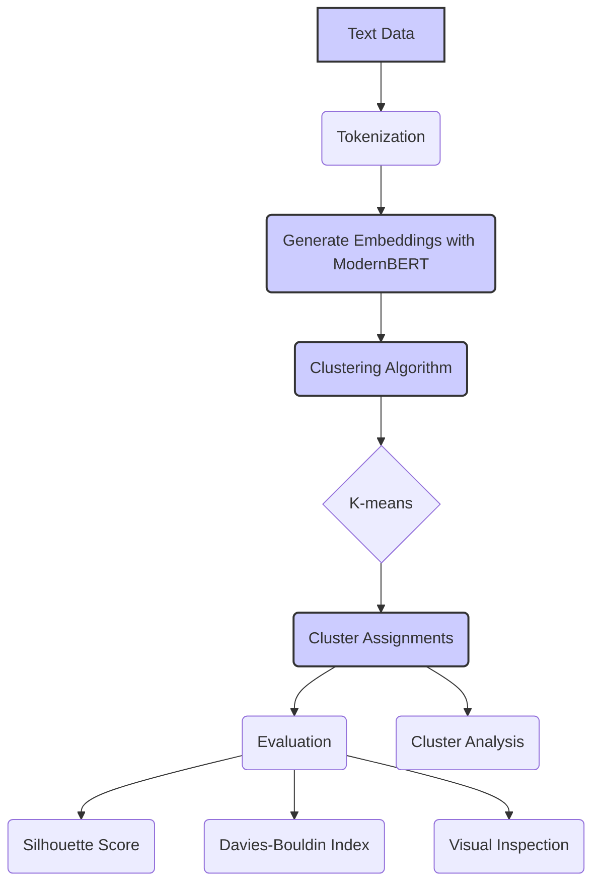

# Clustering Tutorial: Grouping Similar Texts with ModernBERT 🗂️

This tutorial demonstrates how to use the `lightonai/modernbert-embed-large` model to cluster similar text documents. Clustering is an unsupervised machine learning technique that groups data points based on their similarity, and ModernBERT embeddings provide a powerful way to represent the semantic meaning of text for clustering purposes. In this guide, we'll walk through the process of generating embeddings, applying a clustering algorithm, and evaluating the results.

---

## 🛠️ Prerequisites

Make sure you have the following installed:

-   Python 3.7 or higher
-   PyTorch 1.13.0 or higher
-   Hugging Face Transformers 4.26.0 or higher
-   NumPy
-   scikit-learn
-   (Optional) matplotlib for visualization

Install the required packages using pip:

```bash
pip install torch transformers numpy scikit-learn matplotlib
```

---

##  ধাপ 1: Load the Model and Tokenizer

Import the necessary libraries and load the `lightonai/modernbert-embed-large` model and tokenizer.

```python
from transformers import AutoTokenizer, AutoModel
import torch
import numpy as np

model_name = "lightonai/modernbert-embed-large"

# Load the tokenizer
tokenizer = AutoTokenizer.from_pretrained(model_name)

# Load the model
model = AutoModel.from_pretrained(model_name)

# Move the model to the GPU if available
device = torch.device("cuda" if torch.cuda.is_available() else "cpu")
model.to(device)
```

---

## ধাপ 2: Prepare the Text Data

For this tutorial, we'll use a small set of example sentences. In a real application, this could be a collection of documents, news articles, customer reviews, or any other text data you want to cluster.

```python
texts = [
    "ModernBERT is a powerful language model for various NLP tasks.",
    "Clustering algorithms group similar data points together.",
    "This sentence is about semantic search and information retrieval.",
    "K-means is a popular clustering algorithm.",
    "Embeddings capture the semantic meaning of text.",
    "ModernBERT can handle long text sequences efficiently.",
    "Machine learning models can be used for text classification.",
    "This document discusses the applications of clustering in e-commerce.",
    "The cat sat on the mat.",
    "Another example sentence about language models.",
    "Clustering is an unsupervised learning technique."
]
```

---

## ধাপ 3: Generate Embeddings

Tokenize the text data and generate embeddings using the ModernBERT model. We'll use the `[CLS]` token embedding as the sentence-level representation.

```python
# Tokenize the texts
inputs = tokenizer(texts, padding=True, truncation=True, return_tensors="pt", max_length=512)
inputs = {k: v.to(device) for k, v in inputs.items()}

# Generate embeddings
with torch.no_grad():
    outputs = model(**inputs)

# Use [CLS] token embedding as sentence representation
embeddings = outputs.last_hidden_state[:, 0, :].cpu().numpy()
```

---

## ধাপ 4: Apply a Clustering Algorithm

We'll use the K-means algorithm for this tutorial, but other clustering algorithms (e.g., DBSCAN, Agglomerative Clustering) can also be used.

```python
from sklearn.cluster import KMeans

# Choose the number of clusters
num_clusters = 3

# Apply K-means clustering
kmeans = KMeans(n_clusters=num_clusters, random_state=42, n_init=10)
kmeans.fit(embeddings)
labels = kmeans.labels_
```

- `n_clusters`: The number of clusters to form.
- `random_state`: Determines random number generation for centroid initialization. Use a fixed number for reproducibility.
- `n_init`: Number of times the k-means algorithm is run with different centroid seeds.

---

## ধাপ 5: Evaluate the Clustering Results

There are several ways to evaluate clustering results:

1. **Visual Inspection**: If possible, visualize the clusters using dimensionality reduction techniques like t-SNE or PCA (see the "Embedding Visualization" document for more details).

2. **Cluster Statistics**: Analyze the distribution of data points across clusters and examine the characteristics of each cluster.

3. **Silhouette Score**: Measures how similar a data point is to its own cluster compared to other clusters. Ranges from -1 to +1, with higher values indicating better-defined clusters.

4. **Davies-Bouldin Index**: Measures the average similarity between each cluster and its most similar one. Lower values indicate better clustering.

```python
from sklearn.metrics import silhouette_score, davies_bouldin_score

# Calculate Silhouette Score
silhouette_avg = silhouette_score(embeddings, labels)
print(f"Silhouette Score: {silhouette_avg:.4f}")

# Calculate Davies-Bouldin Index
db_index = davies_bouldin_score(embeddings, labels)
print(f"Davies-Bouldin Index: {db_index:.4f}")
```

---

## ধাপ 6: Analyze the Clusters

Let's print the sentences in each cluster to get an idea of how the clustering algorithm grouped them:

```python
for i in range(num_clusters):
    print(f"Cluster {i+1}:")
    for j, text in enumerate(texts):
        if labels[j] == i:
            print(f"  - {text}")
```

---

## (Optional) ধাপ 7: Visualize the Clusters

We can use t-SNE to reduce the dimensionality of the embeddings to 2D and visualize the clusters.

```python
from sklearn.manifold import TSNE
import matplotlib.pyplot as plt

# Apply t-SNE
tsne = TSNE(n_components=2, random_state=42, perplexity=5, n_iter=2000)
reduced_embeddings = tsne.fit_transform(embeddings)

# Plot the clusters
plt.figure(figsize=(8, 6))
for i in range(num_clusters):
    plt.scatter(reduced_embeddings[labels == i, 0], reduced_embeddings[labels == i, 1], label=f"Cluster {i+1}")
plt.legend()
plt.title("t-SNE Visualization of ModernBERT Embeddings Clusters")
plt.xlabel("t-SNE Component 1")
plt.ylabel("t-SNE Component 2")
plt.show()
```

---

## Diagram: Text Clustering with ModernBERT




*Figure 1: Overview of the process for clustering text data using ModernBERT embeddings, from tokenization and embedding generation to applying a clustering algorithm and evaluating the results.*

---

## 🏁 Conclusion

Congratulations! You've successfully used ModernBERT to generate embeddings and cluster similar text documents. This tutorial demonstrates the power of combining a state-of-the-art language model like `lightonai/modernbert-embed-large` with unsupervised learning techniques for text analysis.

From here, you can explore more advanced clustering techniques, experiment with different numbers of clusters, and apply these methods to your own datasets. Clustering has numerous applications in e-commerce, customer segmentation, document organization, and many other areas. By understanding the semantic relationships between text documents, you can gain valuable insights and build more intelligent systems.
