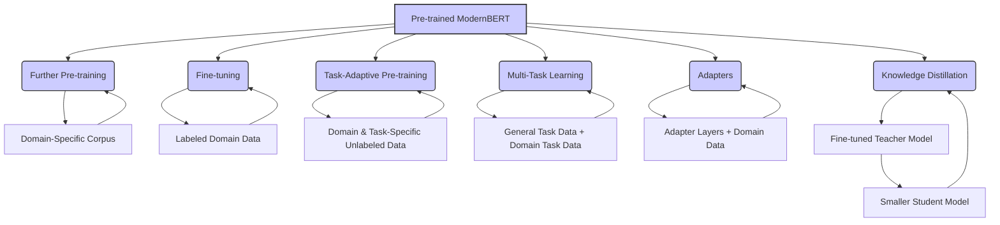

```
# Domain Adaptation: Tailoring ModernBERT to Specialized Fields 🎯

Domain adaptation is a crucial technique for maximizing the effectiveness of pre-trained models like `lightonai/modernbert-embed-large` when applied to specialized fields or tasks that differ significantly from the data it was originally trained on. This document explores the concept of domain adaptation, its importance, and how to apply it to ModernBERT using various methods.

---

## 🤔 Why Domain Adaptation?

While ModernBERT is pre-trained on a massive and diverse dataset, it may not always perform optimally when applied directly to a specific domain with its own unique vocabulary, style, and conventions. Domain adaptation bridges this gap by further training the model on data from the target domain.

**Benefits of Domain Adaptation:**

-   **Improved Performance**: Adapting the model to the target domain can significantly boost its performance on domain-specific tasks.
-   **Better Handling of Domain-Specific Language**: Fine-tuning on in-domain data helps the model learn the nuances of the domain's vocabulary, including specialized terms, acronyms, and jargon.
-   **Adaptation to Different Styles**: Different domains may have different writing styles, levels of formality, or document structures. Domain adaptation helps the model adjust to these differences.
-   **More Robust Embeddings**: By fine-tuning on domain-specific data, the embeddings generated by ModernBERT become more representative of the target domain, improving performance on downstream tasks like clustering and similarity analysis.

---

## 🛠️ Techniques for Domain Adaptation

Several techniques can be used to adapt ModernBERT to a specific domain:

### 1. Further Pre-training (Continued Pre-training)

-   **Concept**: Continue training the pre-trained `lightonai/modernbert-embed-large` model on a large corpus of unlabeled text from the target domain using the same pre-training objectives (e.g., masked language modeling).
-   **How it works**:
    1. Gather a substantial corpus of text data from your target domain (e.g., scientific papers, legal documents, financial reports).
    2. Use the same pre-training objectives as the original ModernBERT model (masked language modeling and sentence ordering prediction) but train on your domain-specific corpus.
    3. Fine-tune the resulting model on your specific downstream task.
-   **Pros**: Can significantly improve performance, especially when the domain is very different from the original pre-training data.
-   **Cons**: Requires a large amount of in-domain text data and significant computational resources.

### 2. Fine-tuning on a Small Labeled Dataset

-   **Concept**: Fine-tune the pre-trained `lightonai/modernbert-embed-large` model on a smaller labeled dataset from the target domain and task.
-   **How it works**:
    1. Collect a labeled dataset for your specific task in the target domain.
    2. Fine-tune the model on this dataset using task-specific loss functions (see the "Fine-Tuning Demo" document for an example).
-   **Pros**: Requires less data than further pre-training. Can be very effective when combined with other techniques.
-   **Cons**: Performance gains might be limited if the labeled dataset is very small.

### 3. Task-Adaptive Pre-training (TAPT)

-   **Concept**: A middle ground between further pre-training and fine-tuning. Involves further pre-training the model on unlabeled data from the target domain *and* task, using the original pre-training objectives.
-   **How it works**:
    1. Collect unlabeled data that is from your target domain and is similar in format to your specific task. For example, if your task is question answering on medical texts, use a corpus of medical questions and answers even if not directly related to your task's specific questions.
    2. Continue pre-training the `lightonai/modernbert-embed-large` model on this data using MLM and SOP.
    3. Fine-tune the resulting model on your labeled task data.
- **Pros**: Leverages both domain and task-specific unlabeled data, often outperforming just continued pretraining or task specific fine-tuning alone.
- **Cons**: Requires collecting task-related unlabeled data, which might not always be feasible.

### 4. Multi-Task Learning

-   **Concept**: Train the model on multiple related tasks simultaneously, including both general and domain-specific tasks.
-   **How it works**:
    1. Define a set of related tasks, including at least one general task (e.g., sentiment analysis on a general dataset) and one or more domain-specific tasks.
    2. Train the model jointly on all tasks, using a combined loss function.
    3. This encourages the model to learn representations that are both general and domain-specific.
-   **Pros**: Can improve performance on the target domain while retaining general-purpose capabilities.
-   **Cons**: Requires labeled data for multiple tasks. Designing an effective multi-task training setup can be complex.

### 5. Using Adapters

-   **Concept**: Add small, trainable modules (adapters) to the pre-trained model without modifying the original weights. These adapters are then trained on the target domain.
-   **How it works**:
    1. Insert adapter layers into the `lightonai/modernbert-embed-large` model's architecture. These are typically small feed-forward networks inserted after each transformer layer.
    2. Freeze the original model weights.
    3. Train only the adapter layers on your domain-specific data.
-   **Pros**: Computationally efficient, as you only train a small number of parameters. Allows for easy switching between different domains by swapping adapters. Preserves the original model's knowledge.
-   **Cons**: Might not be as effective as fine-tuning the entire model for very specialized domains.

### 6. Knowledge Distillation

-   **Concept**: Train a smaller "student" model to mimic the behavior of a larger, fine-tuned "teacher" model on the target domain.
-   **How it works**:
    1. Fine-tune a large `lightonai/modernbert-embed-large` model on your domain-specific task.
    2. Train a smaller model (or a smaller version of ModernBERT) to predict the outputs of the fine-tuned larger model, in addition to the true labels.
    3. This helps transfer the knowledge learned by the larger model to the smaller one.
-   **Pros**: Can create smaller, faster models that retain much of the performance of the larger, fine-tuned model. Useful for deployment in resource-constrained environments.
-   **Cons**: Requires training two models. Performance of the student model is typically bounded by the teacher model.

---

## 💡 Example: Domain Adaptation for Medical Text

Let's say you want to use ModernBERT for a medical information extraction task. Here's how you could apply some of the techniques:

1. **Further Pre-training**:
    
    -   Collect a large corpus of medical text, such as research papers, clinical notes, or medical textbooks.
    -   Continue pre-training `lightonai/modernbert-embed-large` on this corpus using masked language modeling.
    
2. **Task-Adaptive Pre-training**:
    
    -   If your task is, for example, named entity recognition of medical terms, collect a corpus of medical text with similar formatting (sentences, paragraphs) and continue pretraining on this using MLM and SOP.
    
3. **Fine-tuning**:
    
    -   Collect a labeled dataset of medical text with annotations for the entities you want to extract.
    -   Fine-tune the pre-trained or further pre-trained model on this dataset, adding a classification layer on top of ModernBERT to predict the entity labels.
    
4. **Adapters**:
    - Add adapter layers to the pre-trained `lightonai/modernbert-embed-large` model.
    - Freeze the pre-trained weights and train only the adapter layers on your medical NER dataset.

---

## Diagram: Domain Adaptation Strategies




*Figure 1: Overview of different domain adaptation strategies for ModernBERT, including further pre-training, fine-tuning, task-adaptive pre-training, multi-task learning, adapters, and knowledge distillation.*

---

## 🏁 Conclusion

Domain adaptation is a powerful approach for tailoring ModernBERT to the specific characteristics of your target domain and task. By employing techniques like further pre-training, task-adaptive pretraining, fine-tuning, multi-task learning, adapters, or knowledge distillation, you can significantly improve the model's performance and make it more effective for your specific application. The choice of the best technique depends on factors like the amount of data available, the similarity between the pre-training domain and your target domain, and the computational resources at your disposal. By carefully considering these factors and experimenting with different approaches, you can unlock the full potential of `lightonai/modernbert-embed-large` in your specialized field.
```
