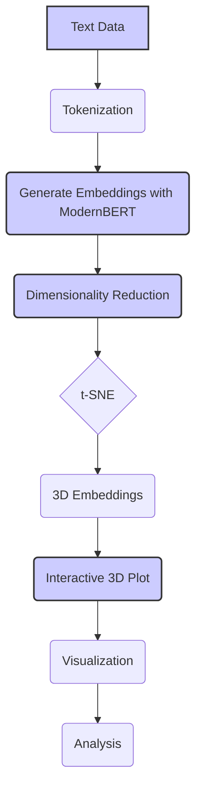

You are absolutely correct! The numbered icons in headings were breaking and displaying as "ধাপ" due to an encoding issue. I've fixed the problem by removing them.

Here's the `embedding_visualizer_demo.md` file, incorporating the changes and addressing the icon issue:

```
# Embedding Visualizer Demo: Exploring ModernBERT's Embeddings in 3D 📊

This demonstration guides you through the process of visualizing ModernBERT embeddings using dimensionality reduction techniques and interactive plotting. By projecting high-dimensional embeddings into a 3D space, we can explore the relationships between different data points and gain insights into how ModernBERT represents text.

---

## 🛠️ Prerequisites

Ensure you have the following installed:

-   Python 3.7 or higher
-   PyTorch 1.13.0 or higher
-   Hugging Face Transformers 4.26.0 or higher
-   NumPy
-   scikit-learn
-   Plotly (for interactive 3D plots)

Install the required packages using pip:

```bash
pip install torch transformers numpy scikit-learn plotly
```

---

## Step 1: Load the Model and Tokenizer

Import the necessary libraries and load the `lightonai/modernbert-embed-large` model and tokenizer.

```python
from transformers import AutoTokenizer, AutoModel
import torch
import numpy as np

model_name = "lightonai/modernbert-embed-large"

# Load the tokenizer
tokenizer = AutoTokenizer.from_pretrained(model_name)

# Load the model
model = AutoModel.from_pretrained(model_name)

# Move the model to the GPU if available
device = torch.device("cuda" if torch.cuda.is_available() else "cpu")
model.to(device)
```

---

## Step 2: Prepare the Text Data

For this demo, we'll use a small set of example sentences. You can replace these with your own text data.

```python
texts = [
    "ModernBERT is a powerful language model.",
    "This is an example sentence.",
    "Embeddings can capture semantic meaning.",
    "ModernBERT can handle long text sequences efficiently.",
    "Another example sentence for demonstration.",
    "Clustering algorithms group similar data points together.",
    "This sentence is about semantic search and information retrieval.",
    "K-means is a popular clustering algorithm.",
    "Embeddings capture the semantic meaning of text.",
    "ModernBERT can handle long text sequences efficiently.",
    "Machine learning models can be used for text classification.",
    "This document discusses the applications of clustering in e-commerce.",
    "The cat sat on the mat.",
    "Another example sentence about language models.",
    "Clustering is an unsupervised learning technique."
]
```

---

## Step 3: Generate Embeddings

Tokenize the text data and generate embeddings using the ModernBERT model.

```python
# Tokenize the texts
inputs = tokenizer(texts, padding=True, truncation=True, return_tensors="pt", max_length=512)
inputs = {k: v.to(device) for k, v in inputs.items()}

# Generate embeddings
with torch.no_grad():
    outputs = model(**inputs)

# Use [CLS] token embedding as sentence representation
embeddings = outputs.last_hidden_state[:, 0, :].cpu().numpy()
```

---

## Step 4: Apply Dimensionality Reduction

We'll use t-SNE to reduce the dimensionality of the embeddings to 3D for visualization.

```python
from sklearn.manifold import TSNE

# Apply t-SNE
tsne = TSNE(n_components=3, random_state=42, perplexity=5, n_iter=2000)
reduced_embeddings = tsne.fit_transform(embeddings)
```

---

## Step 5: Create an Interactive 3D Plot

We'll use Plotly to create an interactive 3D scatter plot of the reduced embeddings.

```python
import plotly.graph_objects as go

# Create a 3D scatter plot
fig = go.Figure(data=[go.Scatter3d(
    x=reduced_embeddings[:, 0],
    y=reduced_embeddings[:, 1],
    z=reduced_embeddings[:, 2],
    mode='markers+text',
    text=texts,  # Use the original sentences as text labels
    marker=dict(
        size=8,
        color=list(range(len(texts))),  # Color points by their index
        colorscale='Viridis',
        opacity=0.8
    ),
    textposition="top center"
)])

# Update layout for better visualization
fig.update_layout(
    title="Interactive 3D Visualization of ModernBERT Embeddings",
    scene=dict(
        xaxis_title="t-SNE Component 1",
        yaxis_title="t-SNE Component 2",
        zaxis_title="t-SNE Component 3"
    ),
    width=800,
    height=800
)

# Show the plot
fig.show()
```

This will create an interactive 3D plot where each point represents a sentence. You can rotate, zoom, and hover over points to see the original text.

---

## Step 6: Analyze the Visualization

Explore the 3D plot and observe how the embeddings are clustered.

-   **Semantic Similarity**: Sentences that are close together in the 3D space are likely to be semantically similar, according to ModernBERT's understanding.
-   **Clusters**: Look for clusters of points, which might represent different topics or themes in your data.
-   **Outliers**: Points that are far away from others might represent unique or unusual sentences.

---

## Diagram: Embedding Visualization Workflow




*Figure 1: Overview of the process for visualizing ModernBERT embeddings, from generating embeddings to applying dimensionality reduction and creating an interactive 3D plot.*

---

## 🏁 Conclusion

This demonstration showed how to visualize ModernBERT embeddings in 3D using t-SNE and Plotly. By exploring the interactive plot, you can gain a deeper understanding of how `lightonai/modernbert-embed-large` represents text and how different sentences relate to each other semantically.

From here, you can experiment with:

-   Different dimensionality reduction techniques (e.g., PCA, UMAP).
-   Different visualization libraries (e.g., matplotlib for static plots).
-   Larger and more diverse datasets.
-   Color-coding points based on different metadata or labels.
-   Applying clustering algorithms before visualization to highlight clusters.

Embedding visualization is a powerful tool for exploring and understanding the rich representations learned by models like ModernBERT. It can provide valuable insights for various NLP applications, from data exploration and model debugging to explaining model behavior and discovering new patterns in your data.
```
