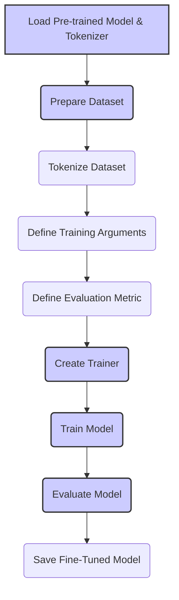

# Fine-Tuning Demo: Adapting ModernBERT to Specific Tasks 🏋️‍♀️

This demonstration walks you through the process of fine-tuning the `lightonai/modernbert-embed-large` model on a specific task: sentiment classification. Fine-tuning involves taking the pre-trained model and training it further on a labeled dataset specific to your task, allowing the model to adapt its knowledge and improve its performance on the target domain.

---

## 🛠️ Prerequisites

Ensure you have the following installed:

-   Python 3.7 or higher
-   PyTorch 1.13.0 or higher
-   Hugging Face Transformers 4.26.0 or higher
-   Hugging Face Datasets library
-   NumPy
-   scikit-learn
-   tqdm

Install the required packages using pip:

```bash
pip install torch transformers datasets numpy scikit-learn tqdm
```

---

##  ধাপ 1: Load the Model and Tokenizer

Import the necessary libraries and load the `lightonai/modernbert-embed-large` model and tokenizer. We'll use `AutoModelForSequenceClassification` to load a version of the model with a classification head.

```python
from transformers import AutoTokenizer, AutoModelForSequenceClassification
import torch

model_name = "lightonai/modernbert-embed-large"

# Load the tokenizer
tokenizer = AutoTokenizer.from_pretrained(model_name)

# Load the model with a classification head
# Specify num_labels for your specific task (e.g., 2 for binary classification)
num_labels = 2
model = AutoModelForSequenceClassification.from_pretrained(model_name, num_labels=num_labels)

# Move the model to the GPU if available
device = torch.device("cuda" if torch.cuda.is_available() else "cpu")
model.to(device)
```

---

## ধাপ 2: Prepare the Dataset

For this demo, we'll use the SST-2 (Stanford Sentiment Treebank) dataset, which contains sentences from movie reviews with corresponding sentiment labels (positive or negative).

```python
from datasets import load_dataset

# Load the SST-2 dataset
dataset = load_dataset("glue", "sst2")

# Tokenize the dataset
def tokenize_function(examples):
    return tokenizer(examples["sentence"], padding="max_length", truncation=True, max_length=128)

tokenized_datasets = dataset.map(tokenize_function, batched=True)

# Convert labels to tensors
def format_labels(examples):
    return {"labels": torch.tensor(examples["label"])}

tokenized_datasets = tokenized_datasets.map(format_labels, batched=True)

# Rename label to labels
tokenized_datasets = tokenized_datasets.rename_column("label", "labels")

# Select a subset for demonstration purposes (optional)
small_train_dataset = tokenized_datasets["train"].shuffle(seed=42).select(range(1000))
small_eval_dataset = tokenized_datasets["validation"].shuffle(seed=42).select(range(100))
```

-   We load the SST-2 dataset using the `datasets` library.
-   We define a `tokenize_function` to tokenize the sentences using the ModernBERT tokenizer.
-   We apply the `tokenize_function` to the entire dataset using the `.map()` method.
-   We convert the labels to PyTorch tensors.
-   (Optional) We select a smaller subset of the training and validation sets for faster training in this demo.

---

## ধাপ 3: Set up the Training Arguments

We'll use the `TrainingArguments` class from the `transformers` library to define the training hyperparameters and settings.

```python
from transformers import TrainingArguments

training_args = TrainingArguments(
    output_dir="./results",
    num_train_epochs=3,
    per_device_train_batch_size=16,
    per_device_eval_batch_size=64,
    warmup_steps=500,
    weight_decay=0.01,
    logging_dir="./logs",
    logging_steps=10,
    evaluation_strategy="steps",
    eval_steps=50,
    save_total_limit=2,
    save_steps=50,
    load_best_model_at_end=True,
    metric_for_best_model="accuracy",
    greater_is_better=True,
    report_to="tensorboard" # Enable TensorBoard logging
)
```

- `output_dir`: Directory to save the training results.
- `num_train_epochs`: Number of training epochs.
- `per_device_train_batch_size`: Batch size for training.
- `per_device_eval_batch_size`: Batch size for evaluation.
- `warmup_steps`: Number of steps for learning rate warmup.
- `weight_decay`: Strength of weight decay (L2 regularization).
- `logging_dir`: Directory to save logs.
- `logging_steps`: Log training information every specified number of steps.
- `evaluation_strategy`: When to evaluate the model. We set it to "steps" here.
- `eval_steps`: Perform evaluation every specified number of steps.
- `save_total_limit`: Limit the total number of checkpoints.
- `save_steps`: Save a checkpoint every specified number of steps.
- `load_best_model_at_end`: Whether to load the best model (according to `metric_for_best_model`) at the end of training.
- `metric_for_best_model`: The metric to use to compare models.
- `greater_is_better`: Whether a larger value of the metric indicates a better model.
- `report_to`: The list of integrations to report the results and logs to. Here we enable TensorBoard.

---

## ধাপ 4: Define the Evaluation Metric

We'll use accuracy as the evaluation metric for this sentiment classification task.

```python
import numpy as np
from datasets import load_metric

metric = load_metric("accuracy")

def compute_metrics(eval_pred):
    logits, labels = eval_pred
    predictions = np.argmax(logits, axis=-1)
    return metric.compute(predictions=predictions, references=labels)
```

---

## ধাপ 5: Train the Model

We'll use the `Trainer` class from the `transformers` library to handle the training process.

```python
from transformers import Trainer

trainer = Trainer(
    model=model,
    args=training_args,
    train_dataset=small_train_dataset,
    eval_dataset=small_eval_dataset,
    compute_metrics=compute_metrics,
)

trainer.train()
```

---

## ধাপ 6: Evaluate the Model

After training, we evaluate the model's performance on the validation set.

```python
results = trainer.evaluate()
print(results)
```

---

## ধাপ 7: Save and Load the Fine-Tuned Model

Save the fine-tuned model and tokenizer for later use.

```python
model.save_pretrained("./fine_tuned_model")
tokenizer.save_pretrained("./fine_tuned_model")

# To load the fine-tuned model later:
# model = AutoModelForSequenceClassification.from_pretrained("./fine_tuned_model")
# tokenizer = AutoTokenizer.from_pretrained("./fine_tuned_model")
```

---

## (Optional) ধাপ 8: Visualize Training with TensorBoard

You can visualize the training process using TensorBoard. Run the following command in your terminal from the directory above `logs`:

```bash
tensorboard --logdir logs
```

Then open your web browser and navigate to the provided URL (usually `http://localhost:6006/`) to view the TensorBoard dashboard.

---

## Diagram: Fine-Tuning Workflow




*Figure 1: Overview of the fine-tuning workflow for adapting ModernBERT to a specific task, from loading the pre-trained model and preparing the dataset to training, evaluating, and saving the fine-tuned model.*

---

## 🏁 Conclusion

Congratulations! You've successfully fine-tuned the `lightonai/modernbert-embed-large` model on a sentiment classification task. This demonstration provides a starting point for adapting ModernBERT to your own specific tasks and datasets. You can now use your fine-tuned model for inference on new data.

Remember that fine-tuning often involves experimentation with different hyperparameters, data preprocessing techniques, and training strategies. You may need to iterate on the process to achieve optimal performance for your particular application.

Further steps to explore:

-   Try different hyperparameters and training settings.
-   Use a larger dataset for fine-tuning.
-   Apply the fine-tuned model to other NLP tasks.
-   Explore more advanced training techniques, such as using a custom training loop or incorporating additional loss functions.
-   Analyze the model's predictions and perform error analysis to identify areas for improvement.

By mastering the fine-tuning process, you can unlock the full potential of ModernBERT and tailor it to excel in your specific domain and applications.