# 🌟 ModernBERT Embedding Model: Overview

Welcome to the comprehensive documentation for the **ModernBERT Embedding Model**! This section is dedicated to exploring the embedding-specific capabilities of ModernBERT, focusing on `lightonai/modernbert-embed-large` and its related models. These models are optimized to generate high-quality semantic vector embeddings, enabling cutting-edge applications across a variety of industries.

---

## 🧩 **What Are Embeddings?**

Embeddings are dense, numerical representations of text data that encapsulate its semantic meaning. By transforming words, sentences, or entire documents into high-dimensional vectors, embeddings provide a way to understand and process text computationally. Similar meanings are placed closer together in this vector space, enabling powerful downstream tasks like clustering, search, and similarity detection.

**Key Characteristics of ModernBERT Embeddings:**

1. **Semantic Depth**: Embeddings reflect deep contextual relationships within and across documents.
2. **High Efficiency**: Optimized for both speed and scalability using cutting-edge techniques like **Flash Attention** and **Rotary Positional Embeddings (RoPE)**.
3. **Extended Sequence Length**: Handles up to 8192 tokens, making it suitable for long-form text embedding.

**Figure 1**: Overview of the ModernBERT Embedding Model workflow, showcasing the transition from input text to embedding vectors and their applications.

---

## 🚀 **Why ModernBERT for Embeddings?**

The ModernBERT Embedding Model offers several advantages over traditional embedding approaches, including:

- **Bidirectional Context**: Encodes information from both past and future tokens for nuanced understanding.
- **Global and Local Attention**: Balances computational efficiency with semantic depth by integrating sliding windows and full sequence attention.
- **Hardware Awareness**: Optimized for consumer GPUs (e.g., NVIDIA RTX series) and high-performance GPUs (e.g., A100, H100).
- **Fine-Tuning Capability**: Adaptable for domain-specific applications with minimal overhead.

---

## 🎯 **Applications of ModernBERT Embeddings**

ModernBERT embeddings are versatile and can power applications across industries:

**Figure 2**: Key applications derived from ModernBERT-generated embedding vectors, with extensibility for custom use cases.

### 🧠 **Semantic Search**
Enable intelligent search systems that retrieve information based on meaning, not just keywords. Applications include:

- Knowledge management systems.
- Legal document discovery.
- E-commerce product search.

### 📊 **Clustering and Similarity Analysis**
Group similar texts or measure the semantic similarity between documents, ideal for:

- Customer segmentation in marketing.
- Topic modeling in academia.
- Fraud detection in finance.

### 🔍 **Recommendation Systems**
Leverage embeddings to suggest relevant items or content:

- Personalized content recommendations in streaming platforms.
- Product suggestions in e-commerce.
- Learning material recommendations in education.

### 🏥 **Domain-Specific Use Cases**
ModernBERT’s fine-tuning capabilities make it invaluable for industries like:

- **Healthcare**: Clinical text analysis and medical research.
- **Finance**: Fraud detection and sentiment analysis.
- **Science**: Research paper retrieval and clustering.

---

## 🔑 **Unique Features of ModernBERT-Embed**

Here’s what sets `modernbert-embed-large` apart:

1. **Extended Token Capacity**: Supports embedding texts up to 8192 tokens.
2. **Advanced Attention Mechanisms**: Alternates local and global attention for computational efficiency.
3. **Scalable Performance**: Optimized for large-scale tasks with consumer and enterprise hardware.
4. **Open-Source Accessibility**: Fully available on Hugging Face with an **Apache 2.0 license**.
5. **Hardware-Optimized Design**: Takes advantage of GPU-specific features, including Flash Attention.

---

## 📚 **Documentation Roadmap**

This folder offers a step-by-step guide for using the ModernBERT Embedding Model effectively. Here’s what you’ll find:

1. **[Generating Embeddings](generating_embeddings.md)**: Learn to create embeddings and understand their structure.
2. **[Semantic Search](semantic_search.md)**: Implement semantic search systems with real-world examples.
3. **[Clustering and Similarity](clustering_similarity.md)**: Explore how to group text and measure similarity.
4. **[Vector Databases](vector_databases.md)**: Integrate embeddings with databases like Pinecone or Milvus.
5. **[Fine-Tuning](fine_tuning.md)**: Tailor the embedding model for domain-specific tasks.
6. **[Performance Benchmarks](benchmarks.md)**: Detailed metrics on embedding speed and accuracy.
7. **[Limitations and Considerations](limitations.md)**: Key factors to keep in mind while using ModernBERT embeddings.
8. **[References and Resources](references.md)**: A curated list of references for further reading.

---

## 📊 **Figures Cross-Referenced in This Guide**

- **Figure 1**: Embedding Creation Process.
- **Figure 2**: Attention Mechanisms in ModernBERT.

For additional details, check:

- **[Clustering and Similarity](clustering_similarity.md)**: Covers Figure 2 in depth.

---

## 🎉 **Conclusion**

ModernBERT Embedding Model is your gateway to state-of-the-art text understanding and processing. Its advanced features, open-source nature, and scalability make it an essential tool for any NLP application requiring embeddings.

### 🔗 **Next Steps**
Dive deeper into specific applications:

- Start with **[Generating Embeddings](generating_embeddings.md)**.
- Explore **[Semantic Search](semantic_search.md)** to build intelligent retrieval systems.

---

#### ✨ Empower Your NLP Workflows with ModernBERT! ✨

