# 🛒 ModernBERT for E-commerce: Enhancing Customer Experience and Driving Sales 🛒

The e-commerce landscape is highly competitive, with businesses constantly striving to improve customer experience, personalize recommendations, and optimize operations. **ModernBERT**, with its advanced natural language processing capabilities, offers a powerful solution for achieving these goals by extracting valuable insights from the vast amounts of textual data generated in e-commerce, such as product descriptions, customer reviews, and search queries.

---

## 🛍️ Key Applications of ModernBERT in E-commerce

ModernBERT can revolutionize various aspects of e-commerce:

### **1. Product Search and Discovery**

- **Task**:
  Improve the accuracy and relevance of product search results by understanding the semantic meaning of search queries and product descriptions.

- **Benefits**:
  - **Enhanced Search Relevance**: Deliver more accurate search results, even for complex or ambiguous queries.
  - **Improved User Experience**: Help customers find what they're looking for faster and more easily.
  - **Increased Conversion Rates**: Connect customers with the right products, leading to higher sales.

- **ModernBERT's Edge**:
    - **Semantic Search**: Understand the intent behind search queries and match them to products based on meaning, rather than just keywords. (Cross-referenced in **[Semantic Search](semantic_search.md)**)
    - **Long Context Window**: Analyze entire product descriptions and reviews to gain a comprehensive understanding of product features and customer sentiment. (Cross-referenced in **[Generating Embeddings](generating_embeddings.md)**)

### **2. Personalized Product Recommendations**

- **Task**:
  Provide personalized product recommendations based on customer browsing history, purchase history, and preferences.

- **Benefits**:
  - **Increased Customer Engagement**: Offer relevant product suggestions that keep customers engaged and browsing.
  - **Higher Average Order Value**: Encourage customers to purchase more items by recommending complementary or related products.
  - **Improved Customer Loyalty**: Build stronger customer relationships by demonstrating an understanding of their individual needs.

- **ModernBERT's Edge**:
    - **Customer Profile Understanding**: Build rich customer profiles by analyzing their interactions with product descriptions, reviews, and other textual data.
    - **Similarity Matching**: Identify products with similar semantic meaning to those a customer has shown interest in. (Cross-referenced in **[Clustering and Similarity](clustering_similarity.md)**)

### **3. Customer Review Analysis and Sentiment Analysis**

- **Task**:
  Analyze customer reviews to understand customer sentiment towards products, identify areas for improvement, and monitor brand reputation.

- **Benefits**:
  - **Actionable Insights**: Identify specific product features that customers love or hate.
  - **Proactive Issue Resolution**: Detect and address negative feedback quickly, mitigating potential damage to brand reputation.
  - **Data-Driven Product Development**: Use customer feedback to inform product development and improvement efforts.

- **ModernBERT's Edge**:
    - **Nuanced Sentiment Analysis**: Accurately interpret complex language, sarcasm, and context-dependent sentiment in customer reviews.
    - **Aspect-Based Sentiment Analysis**: Identify sentiment towards specific product features or aspects (e.g., battery life, camera quality).

### **4. Chatbots and Virtual Assistants**

- **Task**:
  Power intelligent chatbots and virtual assistants that can understand and respond to customer queries, provide product recommendations, and assist with the shopping process.

- **Benefits**:
  - **24/7 Customer Support**: Provide instant support to customers at any time of day or night.
  - **Improved Customer Satisfaction**: Offer quick and accurate responses to customer inquiries.
  - **Reduced Support Costs**: Automate responses to frequently asked questions, freeing up human agents to handle more complex issues.

- **ModernBERT's Edge**:
    - **Natural Language Understanding**: Understand complex and varied customer queries, even with misspellings or grammatical errors.
    - **Contextual Awareness**: Maintain context throughout a conversation to provide more coherent and helpful responses. (Cross-referenced in **[Generating Embeddings](generating_embeddings.md)**)

### **5. Dynamic Pricing and Promotions**

- **Task**:
  Optimize pricing and promotional strategies by analyzing market trends, competitor pricing, and customer demand signals.

- **Benefits**:
  - **Competitive Pricing**: Adjust prices in real-time to stay competitive and maximize revenue.
  - **Targeted Promotions**: Offer personalized promotions based on customer preferences and market trends.
  - **Improved Profitability**: Optimize pricing and promotions to achieve desired profit margins.

- **ModernBERT's Edge**:
    - **Market Trend Analysis**: Analyze news articles, social media, and other textual data to identify emerging trends and adjust pricing accordingly.
    - **Competitor Analysis**: Track competitor pricing and promotions by analyzing their website content and product descriptions.

---

## 🛠️ Implementation with ModernBERT

Integrating ModernBERT into e-commerce workflows typically involves the following steps:

1. **Data Collection**:
    - Gather relevant e-commerce data, such as product descriptions, customer reviews, search queries, and browsing history.

2. **Preprocessing**:
    - Clean and prepare the text data for embedding generation (e.g., removing HTML tags, handling special characters, and lowercasing).

3. **Embedding Generation**:
    - Use the `lightonai/modernbert-embed-large` model to generate embeddings for the preprocessed text data.

4. **Downstream Task Processing**:
    - Apply the generated embeddings to specific tasks, such as:
        - **Search Indexing**: Index product embeddings in a vector database (e.g., Pinecone, Milvus) to enable semantic search. (Cross-referenced in **[Vector Databases](vector_databases.md)**)
        - **Recommendation Engine**: Train a recommendation model on top of the embeddings to predict products that a customer is likely to be interested in.
        - **Sentiment Classification**: Train a classifier on top of the embeddings to predict customer sentiment towards products or brands.
        - **Clustering**: Group similar products or customers to identify trends and patterns. (Cross-referenced in **[Clustering and Similarity](clustering_similarity.md)**)

5. **Integration with Existing Systems**:
    - Incorporate the ModernBERT-powered analysis into existing e-commerce platforms, such as product search engines, recommendation systems, and customer support chatbots.

---

### Diagram 1: ModernBERT Embeddings for E-commerce Applications

*Figure 1: Overview of using ModernBERT embeddings for various e-commerce applications, from product search and recommendations to customer review analysis and dynamic pricing.*

---

## 🔗 Further Exploration

- **[Generating Embeddings](generating_embeddings.md)**: Detailed guide on creating embeddings with ModernBERT.
- **[Semantic Search](semantic_search.md)**: Learn how to implement semantic search for e-commerce.
- **[Clustering and Similarity](clustering_similarity.md)**: Techniques for grouping similar products or customers.
- **[Vector Databases](vector_databases.md)**: Learn how to store and efficiently query ModernBERT embeddings.
- **[Use Cases](use_case.md)**: Explore other industry applications of ModernBERT.

---

## 🏁 Conclusion

**ModernBERT** provides a powerful toolkit for enhancing e-commerce, enabling businesses to deliver more relevant search results, personalize recommendations, understand customer sentiment, and optimize operations. By leveraging its advanced natural language processing capabilities, e-commerce companies can improve customer experience, drive sales, and gain a competitive edge in the rapidly evolving digital marketplace. As the volume of e-commerce data continues to grow, ModernBERT stands ready to unlock valuable insights and drive data-driven decision-making across the industry.