# 💰 ModernBERT for Finance: Revolutionizing Financial Analysis 💰

The finance industry generates vast quantities of textual data daily, from earnings calls and SEC filings to market news and analyst reports. **ModernBERT**, with its extended context window and enhanced processing capabilities, offers a powerful solution for extracting insights from this data deluge. This document explores how ModernBERT's embeddings can transform financial analysis, enabling more accurate risk assessment, improved investment decisions, and streamlined regulatory compliance.

---

## 📈 Key Applications of ModernBERT in Finance

ModernBERT's ability to understand long sequences and capture nuanced semantic relationships makes it exceptionally well-suited for various financial applications:

### **1. Sentiment Analysis of Financial News and Social Media**

- **Task**:  
  Analyze market sentiment by processing news articles, social media posts, and financial reports.
  
- **Benefits**:  
  - **Improved Accuracy**: Understand complex language and context-dependent sentiment (e.g., sarcasm, irony).
  - **Real-time Monitoring**: Track shifts in market sentiment as they happen, enabling timely investment decisions.
  - **Comprehensive Coverage**: Process large volumes of data from diverse sources.

- **ModernBERT's Edge**:  
    - **Long Context Window**: Analyze entire articles or multiple social media posts to capture the overall sentiment more accurately.
    - **Nuanced Understanding**: Discern subtle cues and context-specific meanings that simpler models might miss.

### **2. Risk Assessment and Management**

- **Task**:  
  Evaluate financial risk by analyzing loan applications, credit reports, and market data.

- **Benefits**:  
  - **Enhanced Accuracy**: Identify subtle indicators of risk that traditional methods might overlook.
  - **Automated Processing**: Streamline risk assessment workflows, reducing manual effort and processing time.
  - **Proactive Risk Mitigation**: Detect potential risks early, enabling proactive intervention.

- **ModernBERT's Edge**:
    - **Deep Contextual Understanding**: Identify relationships between seemingly disparate pieces of information to assess risk more accurately.
    - **Extended Sequence Length**: Process entire documents, such as loan applications, to capture a holistic view of the applicant's financial health.

### **3. Algorithmic Trading**

- **Task**:  
  Develop trading strategies based on real-time analysis of financial news, market data, and economic indicators.

- **Benefits**:  
  - **Data-Driven Decisions**: Make informed trading decisions based on a comprehensive understanding of market dynamics.
  - **Speed and Efficiency**: Process vast quantities of data quickly, enabling rapid response to market changes.
  - **Competitive Advantage**: Leverage advanced NLP to identify profitable trading opportunities that others might miss.

- **ModernBERT's Edge**:
    - **Real-time Analysis**: Process streaming data to make timely trading decisions.
    - **Contextual Awareness**: Understand the impact of news events and market sentiment on asset prices.

### **4. Regulatory Compliance and Reporting**

- **Task**:  
  Ensure adherence to financial regulations by analyzing documents for compliance with legal requirements.

- **Benefits**:  
  - **Automated Compliance Checks**: Quickly identify potential compliance issues, reducing manual review time.
  - **Reduced Risk of Penalties**: Ensure adherence to regulations, minimizing the risk of fines and legal repercussions.
  - **Comprehensive Auditing**: Analyze large volumes of documents to ensure thorough compliance across the organization.

- **ModernBERT's Edge**:
    - **Long Document Processing**: Analyze entire regulatory documents and contracts to ensure comprehensive compliance.
    - **Semantic Understanding**: Accurately interpret complex legal language and identify potential compliance gaps.

### **5. Investment Research and Due Diligence**

- **Task**:
    - Analyze company filings, earnings call transcripts, and analyst reports to inform investment decisions.

- **Benefits**:
    - **In-depth Analysis**: Gain a deeper understanding of a company's financial health, strategy, and market position.
    - **Efficient Research**: Quickly process and summarize large volumes of information, saving analysts' time.
    - **Data-Driven Insights**: Identify key trends, opportunities, and risks that might be missed through manual analysis.

- **ModernBERT's Edge**:
    - **Extended Context Window**: Analyze entire earnings call transcripts or lengthy SEC filings to capture the full context of the discussion.
    - **Semantic Similarity**: Identify relationships between different documents and data points to uncover hidden insights.

---

## 🛠️ Implementation with ModernBERT

Integrating ModernBERT into financial workflows typically involves the following steps:

1. **Data Collection**:  
    - Gather relevant financial data, such as news articles, SEC filings, earnings call transcripts, and social media posts.

2. **Preprocessing**:  
    - Clean and prepare the text data for embedding generation (e.g., removing irrelevant characters, handling special tokens).

3. **Embedding Generation**:  
    - Use the `lightonai/modernbert-embed-large` model to generate embeddings for the preprocessed text data.

4. **Downstream Task Processing**:
    - Apply the generated embeddings to specific tasks, such as:
        - **Sentiment Classification**: Train a classifier on top of the embeddings to predict market sentiment.
        - **Risk Scoring**: Develop a model that uses embeddings to assess financial risk.
        - **Similarity Search**: Use a vector database (e.g., Pinecone, Milvus) to find documents similar to a query embedding for due diligence.
        - **Clustering**: Group similar financial documents for topic modeling or trend analysis.

5. **Integration with Existing Systems**:
    - Incorporate the ModernBERT-powered analysis into existing financial platforms, trading systems, or compliance workflows.

---

### Diagram 1: ModernBERT Embeddings for Financial Analysis

*Figure 1: Overview of using ModernBERT embeddings for various financial analysis tasks, from sentiment analysis to risk assessment and algorithmic trading.*

---

## 🔗 Further Exploration

- **[Generating Embeddings](generating_embeddings.md)**: Detailed guide on creating embeddings with ModernBERT.
- **[Clustering and Similarity](clustering_similarity.md)**: Techniques for grouping and comparing financial documents.
- **[Vector Databases](vector_databases.md)**: Learn how to store and efficiently query ModernBERT embeddings.
- **[Use Cases](use_case.md)**: Explore other industry applications of ModernBERT.

---

## 🏁 Conclusion

**ModernBERT** offers a transformative approach to financial analysis, providing the ability to process and understand vast quantities of textual data with unprecedented accuracy and efficiency. By leveraging its advanced embedding capabilities, financial institutions can enhance risk management, improve investment strategies, streamline compliance, and gain a competitive edge in the rapidly evolving financial landscape. As the volume of financial data continues to grow, ModernBERT stands ready to unlock valuable insights and drive data-driven decision-making across the industry.`
