# 🩺 ModernBERT for Healthcare: Transforming Patient Care and Medical Research 🩺

The healthcare industry is undergoing a data revolution, with vast amounts of textual information generated daily from electronic health records (EHRs), clinical notes, medical research papers, and patient forums. **ModernBERT**, with its extended context window and ability to understand complex language, offers a powerful solution for extracting valuable insights from this data, leading to improved patient care, accelerated medical research, and more efficient healthcare operations.

---

## 🏥 Key Applications of ModernBERT in Healthcare

ModernBERT's advanced capabilities make it ideal for a wide range of healthcare applications:

### **1. Clinical Note Processing and Analysis**

- **Task**:
  Analyze unstructured clinical notes to extract patient information, identify diagnoses, track treatment progress, and detect potential adverse events.

- **Benefits**:
  - **Improved Accuracy**: Understand complex medical terminology, abbreviations, and nuanced language used in clinical notes.
  - **Time Savings**: Automate the extraction of key information, freeing up clinicians' time for patient care.
  - **Enhanced Patient Monitoring**: Track patient progress over time and identify potential risks or complications.

- **ModernBERT's Edge**:
    - **Long Context Window**: Analyze entire clinical notes or patient histories to capture a holistic view of the patient's condition.
    - **Contextual Understanding**: Interpret medical terms in the context of the patient's specific situation, improving accuracy.

### **2. Medical Literature Review and Research**

- **Task**:
  Process and analyze vast quantities of medical literature, including research papers, clinical trial reports, and medical textbooks.

- **Benefits**:
  - **Accelerated Research**: Quickly identify relevant papers and extract key findings, speeding up the research process.
  - **Knowledge Discovery**: Uncover hidden connections and insights across different research areas.
  - **Improved Evidence-Based Medicine**: Facilitate the synthesis of evidence to inform clinical guidelines and treatment decisions.

- **ModernBERT's Edge**:
    - **Extended Sequence Length**: Process entire research papers to understand the full context of the study.
    - **Semantic Similarity**: Identify relationships between different studies and concepts to build a more comprehensive understanding of a topic.

### **3. Diagnosis Assistance and Decision Support**

- **Task**:
  Assist clinicians in diagnosing diseases and developing treatment plans by analyzing patient data and medical literature.

- **Benefits**:
  - **Improved Diagnostic Accuracy**: Identify potential diagnoses that might be missed through manual review.
  - **Personalized Treatment Recommendations**: Tailor treatment plans to the individual patient's characteristics and medical history.
  - **Reduced Diagnostic Errors**: Provide clinicians with a "second opinion" based on the latest medical knowledge.

- **ModernBERT's Edge**:
    - **Deep Contextual Understanding**: Combine patient-specific information with broader medical knowledge to suggest potential diagnoses and treatments.
    - **Real-time Analysis**: Process new patient data as it becomes available to provide up-to-date recommendations.

### **4. Patient Monitoring and Remote Care**

- **Task**:
  Analyze patient-generated data, such as from wearable devices or online forums, to monitor health status and provide remote support.

- **Benefits**:
  - **Proactive Intervention**: Identify early warning signs of health issues and intervene before they escalate.
  - **Personalized Care**: Tailor remote care plans to the individual patient's needs and preferences.
  - **Improved Patient Engagement**: Empower patients to take a more active role in managing their health.

- **ModernBERT's Edge**:
    - **Sentiment Analysis**: Detect changes in patient sentiment or emotional state that might indicate a need for intervention.
    - **Contextual Awareness**: Understand patient-reported symptoms and concerns in the context of their overall health status.

### **5. Drug Discovery and Development**

- **Task**:
  Analyze biomedical literature and research data to identify potential drug targets, predict drug efficacy, and accelerate the drug development process.

- **Benefits**:
  - **Faster Drug Discovery**: Identify promising drug candidates more quickly and efficiently.
  - **Reduced Development Costs**: Optimize the drug development process, reducing the risk of costly failures.
  - **Improved Drug Safety**: Predict potential side effects and drug interactions early in the development process.

- **ModernBERT's Edge**:
    - **Biomedical Language Understanding**: Process and interpret complex biomedical terminology and concepts.
    - **Knowledge Graph Construction**: Identify relationships between genes, proteins, diseases, and drugs to build a more comprehensive understanding of biological systems.

---

## 🛠️ Implementation with ModernBERT

Integrating ModernBERT into healthcare workflows typically involves the following steps:

1. **Data Collection**:
    - Gather relevant healthcare data, such as EHRs, clinical notes, research papers, and patient-reported data.

2. **Preprocessing**:
    - Clean and prepare the text data for embedding generation (e.g., anonymization, handling medical codes, removing irrelevant characters).

3. **Embedding Generation**:
    - Use the `lightonai/modernbert-embed-large` model to generate embeddings for the preprocessed text data.

4. **Downstream Task Processing**:
    - Apply the generated embeddings to specific tasks, such as:
        - **Classification**: Train a classifier on top of the embeddings to predict diagnoses, identify patient risk factors, or categorize medical literature.
        - **Named Entity Recognition (NER)**: Extract specific medical entities, such as diagnoses, medications, and procedures, from clinical notes.
        - **Relationship Extraction**: Identify relationships between medical concepts, such as drug-drug interactions or disease-symptom associations.
        - **Similarity Search**: Use a vector database (e.g., Pinecone, Milvus) to find similar patients, research papers, or clinical cases.
        - **Clustering**: Group similar patients or research papers to identify patterns and insights.

5. **Integration with Existing Systems**:
    - Incorporate the ModernBERT-powered analysis into existing healthcare systems, such as EHRs, clinical decision support systems, or research platforms.

---

## Diagram 1: ModernBERT Embeddings for Healthcare Applications

*Figure 1: Overview of using ModernBERT embeddings for various healthcare applications, from clinical note analysis to drug discovery.*

---

## 🔗 Further Exploration

- **[Generating Embeddings](generating_embeddings.md)**: Detailed guide on creating embeddings with ModernBERT.
- **[Clustering and Similarity](clustering_similarity.md)**: Techniques for grouping and comparing patients or medical documents.
- **[Vector Databases](vector_databases.md)**: Learn how to store and efficiently query ModernBERT embeddings.
- **[Use Cases](use_case.md)**: Explore other industry applications of ModernBERT.

---

## 🏁 Conclusion

**ModernBERT** offers a transformative approach to healthcare, providing the ability to process and understand vast quantities of textual data with unprecedented accuracy and efficiency. By leveraging its advanced embedding capabilities, healthcare organizations can improve patient care, accelerate medical research, streamline operations, and ultimately, deliver better health outcomes. As the volume of healthcare data continues to grow, ModernBERT stands ready to unlock valuable insights and drive innovation across the industry.