# 🧪 ModernBERT for Science: Accelerating Scientific Discovery and Analysis 🧪

The scientific community generates a massive and ever-growing corpus of research papers, experimental data, technical reports, and scientific discussions. **ModernBERT**, with its extended context window, advanced language understanding, and efficient processing capabilities, provides a powerful toolkit for navigating this complex landscape, accelerating scientific discovery, and extracting valuable insights from scientific text.

---

## 🔬 Key Applications of ModernBERT in Science

ModernBERT's capabilities are transforming various scientific domains:

### **1. Scientific Literature Review and Analysis**

- **Task**:
  Process and analyze vast quantities of scientific literature to identify relevant research, extract key findings, and synthesize knowledge.

- **Benefits**:
  - **Accelerated Research**: Quickly find and prioritize relevant papers, speeding up the literature review process.
  - **Comprehensive Coverage**: Analyze a broader range of research than possible through manual review.
  - **Knowledge Synthesis**: Identify connections and patterns across different studies to build a more holistic understanding of a research area.

- **ModernBERT's Edge**:
    - **Long Context Window**: Analyze entire research papers or technical reports to capture the full context of the study, including methodology, results, and discussion. (Cross-referenced in **[Generating Embeddings](generating_embeddings.md)**)
    - **Semantic Understanding**: Accurately interpret complex scientific terminology, experimental setups, and nuanced arguments.

### **2. Hypothesis Generation and Experimental Design**

- **Task**:
  Assist scientists in formulating new hypotheses and designing experiments by analyzing existing research and identifying knowledge gaps.

- **Benefits**:
  - **Data-Driven Hypotheses**: Generate hypotheses based on patterns and insights extracted from a large body of scientific literature.
  - **Optimized Experimental Design**: Identify potential pitfalls or confounding factors by analyzing previous experimental designs.
  - **Innovation Acceleration**: Facilitate the development of novel research directions by identifying unexplored areas.

- **ModernBERT's Edge**:
    - **Relationship Extraction**: Identify relationships between different scientific concepts, such as genes, proteins, and diseases, to suggest potential research directions.
    - **Contextual Awareness**: Understand the limitations and assumptions of previous studies to inform the design of new experiments.

### **3. Data Extraction and Knowledge Base Construction**

- **Task**:
  Extract structured information from unstructured scientific text, such as experimental results, parameters, and data points, to build structured knowledge bases.

- **Benefits**:
  - **Automated Data Curation**: Automate the process of extracting and organizing data from scientific literature, reducing manual effort.
  - **Data Integration**: Combine data from multiple sources to create comprehensive and interconnected knowledge bases.
  - **Enhanced Data Accessibility**: Make scientific data more easily searchable and reusable for future research.

- **ModernBERT's Edge**:
    - **Named Entity Recognition (NER)**: Identify and extract specific scientific entities, such as gene names, chemical compounds, and experimental conditions. (Cross-referenced in **[Fine-Tuning](fine_tuning.md)**)
    - **Accurate Information Retrieval**: Extract precise numerical data and experimental parameters with high accuracy.

### **4. Automated Scientific Writing Assistance**

- **Task**:
  Assist scientists in writing research papers, grant proposals, and technical reports by providing suggestions for language, structure, and content.

- **Benefits**:
  - **Improved Writing Quality**: Suggest more precise and concise language, improving the clarity and impact of scientific writing.
  - **Time Savings**: Automate some aspects of the writing process, freeing up scientists' time for research.
  - **Enhanced Collaboration**: Facilitate collaborative writing by providing a shared platform for drafting and editing scientific documents.

- **ModernBERT's Edge**:
    - **Scientific Language Generation**: Generate text that is consistent with the style and conventions of scientific writing.
    - **Contextual Suggestions**: Provide suggestions for content and structure that are relevant to the specific research topic and context.

### **5. Patent Analysis and Intellectual Property Management**

- **Task**:
  Analyze patent documents to identify prior art, assess the novelty of inventions, and manage intellectual property portfolios.

- **Benefits**:
  - **Comprehensive Prior Art Search**: Identify relevant patents that might otherwise be missed through traditional keyword-based searches.
  - **Automated Patent Analysis**: Extract key information from patents, such as claims, inventors, and assignees.
  - **Strategic IP Management**: Inform decisions about patent filing, licensing, and enforcement.

- **ModernBERT's Edge**:
    - **Long Document Processing**: Analyze entire patent documents, which can be very lengthy and complex.
    - **Semantic Similarity**: Identify patents with similar claims or technical descriptions, even if they use different terminology. (Cross-referenced in **[Clustering and Similarity](clustering_similarity.md)**)

---

## 🛠️ Implementation with ModernBERT

Integrating ModernBERT into scientific workflows typically involves the following steps:

1. **Data Collection**:
    - Gather relevant scientific data, such as research papers, technical reports, patent documents, and experimental data.

2. **Preprocessing**:
    - Clean and prepare the text data for embedding generation (e.g., removing irrelevant characters, handling scientific notation, and special symbols).

3. **Embedding Generation**:
    - Use the `lightonai/modernbert-embed-large` model to generate embeddings for the preprocessed text data.

4. **Downstream Task Processing**:
    - Apply the generated embeddings to specific tasks, such as:
        - **Classification**: Train a classifier on top of the embeddings to categorize research papers by topic, identify potential drug targets, or predict experimental outcomes.
        - **Clustering**: Group similar research papers or scientific concepts to identify research trends and knowledge gaps. (Cross-referenced in **[Clustering and Similarity](clustering_similarity.md)**)
        - **Similarity Search**: Use a vector database (e.g., Pinecone, Milvus) to find research papers, patents, or data points similar to a query embedding. (Cross-referenced in **[Vector Databases](vector_databases.md)**)
        - **Relationship Extraction**: Identify relationships between scientific entities, such as gene-gene interactions or protein-protein interactions.
        - **Question Answering**: Build systems that can answer scientific questions based on a corpus of research papers or technical documents.

5. **Integration with Existing Systems**:
    - Incorporate the ModernBERT-powered analysis into existing scientific platforms, such as research databases, electronic lab notebooks, or patent search engines.

---

### Diagram 1: ModernBERT Embeddings for Scientific Applications

*Figure 1: Overview of using ModernBERT embeddings for various scientific applications, from literature review and hypothesis generation to data extraction and patent analysis.*

---

## 🔗 Further Exploration

- **[Generating Embeddings](generating_embeddings.md)**: Detailed guide on creating embeddings with ModernBERT.
- **[Clustering and Similarity](clustering_similarity.md)**: Techniques for grouping and comparing scientific documents or concepts.
- **[Vector Databases](vector_databases.md)**: Learn how to store and efficiently query ModernBERT embeddings.
- **[Use Cases](use_case.md)**: Explore other industry applications of ModernBERT.
- **[Fine-Tuning](fine_tuning.md)**: Learn how to tailor ModernBERT to specific scientific domains and tasks.

---

## 🏁 Conclusion

**ModernBERT** offers a powerful and versatile toolkit for accelerating scientific discovery and transforming the way scientists interact with scientific information. By leveraging its advanced embedding capabilities, researchers can process and analyze vast quantities of scientific text more efficiently and effectively, leading to new insights, better-informed decisions, and ultimately, faster scientific progress. As the volume of scientific data continues to grow exponentially, ModernBERT stands ready to help the scientific community unlock its full potential.