# 🔍 Semantic Search with ModernBERT 🔍

Semantic search is a powerful technique that allows systems to retrieve information based on meaning, not just exact keyword matches. By leveraging **ModernBERT**'s embeddings, semantic search systems can understand the contextual meaning behind a query and retrieve the most relevant documents, even if they don't contain the exact search terms. This section will explain how to implement semantic search using **ModernBERT**, providing both the theoretical foundations and practical steps.

---

## What is Semantic Search?

Traditional keyword-based search engines rely on exact matches between the search terms and documents. This often leads to suboptimal results, as variations in wording, spelling, and synonyms can cause relevant documents to be missed. 

**Semantic search** goes beyond exact matching by understanding the meaning behind words and phrases. It uses embeddings to map both the query and the documents to a high-dimensional space, where the distances between vectors correspond to semantic similarity. This allows the system to retrieve documents based on the underlying meaning rather than just the specific words.

---

## 🧠 How Semantic Search Works with ModernBERT

The process of semantic search with **ModernBERT** can be broken down into the following steps:

### **Step 1: Generate Embeddings for Documents**

The first step in implementing semantic search is to generate embeddings for the documents you want to search. These embeddings are vector representations of the text, capturing the underlying semantic meaning of the content. 

Let’s assume we have a set of documents:

```python
documents = [
    "ModernBERT is a transformer model optimized for generating high-quality semantic embeddings.",
    "Semantic search improves the relevance of search results by understanding query intent.",
    "In this tutorial, we explore how to use ModernBERT to perform semantic search."
]
```

We’ll generate embeddings for each of these documents using **ModernBERT**:

```python
from transformers import AutoTokenizer, AutoModel
import torch

# Load the model and tokenizer
tokenizer = AutoTokenizer.from_pretrained('lightonai/modernbert-embed-large')
model = AutoModel.from_pretrained('lightonai/modernbert-embed-large')

# Tokenize the documents
inputs = tokenizer(documents, padding=True, truncation=True, return_tensors='pt')

# Generate embeddings for the documents
with torch.no_grad():
    outputs = model(**inputs)

# Extract the embeddings
document_embeddings = outputs.last_hidden_state[:, 0, :].numpy()
```

### **Step 2: Generate Embeddings for the Query**

When a user submits a query, the system must also generate an embedding for the query to compare it against the document embeddings. 

Let’s assume the user submits the following query:

```python
query = "How can ModernBERT be used for semantic search?"
```

We generate an embedding for this query in the same manner as we did for the documents:

```python
query_inputs = tokenizer(query, padding=True, truncation=True, return_tensors='pt')

with torch.no_grad():
    query_outputs = model(**query_inputs)

# Extract the query embedding
query_embedding = query_outputs.last_hidden_state[:, 0, :].numpy()
```

### **Step 3: Calculate Similarity Between Query and Documents**

Once we have the embeddings for both the query and the documents, we need to calculate how similar they are. A common way to measure the similarity between two vectors is by using the **cosine similarity** metric. Cosine similarity measures the cosine of the angle between two vectors, which provides a value between -1 (completely dissimilar) and 1 (identical).

```python
from sklearn.metrics.pairwise import cosine_similarity

# Compute cosine similarity between query embedding and document embeddings
similarities = cosine_similarity(query_embedding, document_embeddings)

# Get the most similar document
most_similar_document_index = similarities.argmax()
most_similar_document = documents[most_similar_document_index]
```

The result will be the document that is semantically closest to the query.

---

## 🎯 Optimizing Semantic Search

While the above steps outline the core of semantic search, there are several ways to optimize the process for real-world applications:

### **1. Preprocessing Text**

Before generating embeddings, it's a good practice to preprocess the text. This can include:
- Removing stop words (common words like "the", "is", "in", etc.).
- Lemmatization (reducing words to their base forms).
- Removing special characters and unnecessary whitespace.

### **2. Using Dense Vector Search Indexes**

For large datasets, it's inefficient to compute cosine similarity between the query and all documents in real-time. Instead, you can use **vector search engines** like **Pinecone**, **FAISS**, or **Milvus**. These tools allow you to index and search through large sets of vector embeddings efficiently.

Here’s an example using **FAISS** to perform efficient similarity search:

```python
import faiss

# Convert document embeddings to float32 for FAISS compatibility
document_embeddings = document_embeddings.astype('float32')

# Create a FAISS index
index = faiss.IndexFlatL2(document_embeddings.shape[1])

# Add the embeddings to the index
index.add(document_embeddings)

# Perform the similarity search
D, I = index.search(query_embedding.astype('float32'), k=1)

# Get the most similar document based on index search
most_similar_document = documents[I[0][0]]
```

### **3. Use of Contextual Embeddings**

For highly dynamic queries or specialized domains (e.g., legal, medical), it's important to fine-tune the model on domain-specific data to generate more accurate embeddings. **Fine-tuning** ModernBERT on specific datasets ensures that the model captures the nuances of domain-specific language, improving the quality of semantic search results.

---

## 🏭 Applications of Semantic Search

Implementing **semantic search** with **ModernBERT** unlocks numerous applications across industries:

- **E-Commerce**: 
  Retrieve product recommendations based on user queries, such as "similar to this smartphone" or "best laptops for gaming".

- **Healthcare**: 
  In medical research, semantic search can help researchers quickly find relevant papers or case studies based on specific symptoms, conditions, or treatments.

- **Legal**: 
  Law firms and legal researchers can use semantic search to retrieve case law, contracts, or legal opinions that are most relevant to their queries.

- **Customer Support**: 
  Enhance chatbots and helpdesk systems by enabling them to retrieve contextually relevant documents from knowledge bases, improving response accuracy.

---

## Diagram 1: Semantic Search Flow with ModernBERT

  
*Figure 1: Overview of the semantic search workflow using ModernBERT, from input query to retrieving the best matching document...*

---

## 🏁 Conclusion

By using **ModernBERT** for **semantic search**, you can drastically improve the relevance and accuracy of search results. This powerful model leverages its ability to generate semantically rich embeddings, enabling you to create systems that understand the meaning behind words rather than just matching keywords. With these capabilities, **ModernBERT** is suitable for a wide range of applications, from e-commerce recommendations to legal and healthcare search engines.

---

### 🔗 Next Steps

To explore further, continue with the following guides:

- **[Generating Embeddings](generating_embeddings.md)**: Learn how to generate embeddings for any text.
- **[Clustering and Similarity](clustering_similarity.md)**: Discover how to group and compare text data based on semantic similarity.
- **[Integration with Vector Databases](vector_databases.md)**: Learn how to store and retrieve embeddings efficiently with vector databases.

---

### References

For more information on semantic search and embeddings, check out the resources in **[Embedding Model References](embedding_model/references.md)**.