# 🎯 ModernBERT Embedding Model: Use Cases 🎯

The **ModernBERT Embedding Model** provides high-quality semantic embeddings, which can be applied across a wide range of industries and NLP tasks. These embeddings capture deep contextual relationships between words, sentences, and documents, enabling applications in search, recommendation systems, text clustering, and more. In this section, we explore some of the most compelling use cases of the ModernBERT Embedding Model.

**Figure 1**: Industry-specific applications of ModernBERT embeddings, highlighting versatility across various sectors. Semantic Search Process (cross-referenced in **[Semantic Search](semantic_search.md)**).

**Figure 2**: Key applications derived from ModernBERT-generated embedding vectors, with extensibility for custom use cases.

---

## 📚 **Use Case 1: Semantic Search**

### 🧠 Overview
Semantic search uses embeddings to retrieve information based on the meaning behind the search query, rather than relying solely on keyword matching. By understanding the intent and context of the search, semantic search systems can return more relevant and accurate results.

**Benefits:**

- **Improved Accuracy**: Returns results based on contextual meaning.
- **Handles Synonyms**: Recognizes similar words with the same meaning.
- **Context-Aware**: Understands the intent behind ambiguous queries.

### 🧑‍💻 **Implementation**
Using ModernBERT embeddings, you can create a semantic search engine that transforms both the query and documents into embeddings. These embeddings are then compared to find the closest matches, using techniques like cosine similarity or Euclidean distance.

**Example Workflow**:

- **Step 1**: Convert the search query into an embedding.
- **Step 2**: Convert documents or text chunks into embeddings.
- **Step 3**: Measure the cosine similarity between the query and each document.
- **Step 4**: Rank and return the most relevant documents.

### 💡 **Applications in Semantic Search**:

- **Enterprise Knowledge Management**: Easily search across a vast corpus of documents, finding the most relevant information based on intent.
- **Legal Text Search**: Quickly retrieve relevant legal documents, case studies, or contracts based on context.
- **Customer Support**: Enable more accurate and efficient searches in FAQ systems or knowledge bases.

---

## 🛠️ **Use Case 2: Clustering and Categorization**

### 🧠 Overview
Clustering involves grouping similar pieces of text together based on their semantic meaning. Using ModernBERT embeddings, texts with similar themes, topics, or content can be automatically clustered, making it easier to analyze large datasets.

**Benefits**:

- **Automated Organization**: Grouping similar content helps organize large datasets automatically.
- **Topic Discovery**: Identify hidden themes and trends in data.
- **Scalable**: Can be applied to a vast amount of unstructured text.

### 🧑‍💻 **Implementation**
ModernBERT embeddings can be used as the basis for clustering algorithms like K-means or hierarchical clustering. By representing text as dense vectors, the clustering algorithm groups texts with similar embeddings, making it possible to categorize large corpora of documents effectively.

**Example Workflow**:

- **Step 1**: Convert texts into ModernBERT embeddings.
- **Step 2**: Apply a clustering algorithm like K-means or DBSCAN.
- **Step 3**: Analyze the clusters for meaningful categories or insights.

**Figure 2**: Clustering Texts Based on Embeddings (cross-referenced in **[Clustering and Similarity](clustering_similarity.md)**).

### 💡 **Applications in Clustering**:

- **Customer Sentiment Analysis**: Group customer feedback based on sentiment or intent.
- **News Article Categorization**: Automatically categorize articles by topics like politics, health, or sports.
- **Content Tagging**: Automatically tag content with relevant labels based on its semantic content.

---

## 🛒 **Use Case 3: Personalized Recommendation Systems**

### 🧠 Overview
ModernBERT embeddings can power recommendation systems by comparing the embeddings of user profiles and items (products, movies, articles) to recommend content that is semantically similar to what a user has interacted with or shown interest in.

**Benefits**:

- **Context-Aware**: Recommendations are based on deeper understanding rather than surface-level patterns.
- **Enhanced Accuracy**: Recommends more relevant content by considering the user's specific preferences.
- **Personalized Experience**: Offers a tailored experience for each user.

### 🧑‍💻 **Implementation**
The recommendation engine works by generating embeddings for both user profiles and items (e.g., products, movies). The system then computes the cosine similarity between the user’s embedding and the embeddings of items in the catalog. The items with the highest similarity scores are presented as recommendations.

**Example Workflow**:

- **Step 1**: Generate embeddings for the user’s preferences and past interactions.
- **Step 2**: Create embeddings for items in the catalog.
- **Step 3**: Calculate the similarity between the user embedding and item embeddings.
- **Step 4**: Rank the items by similarity and recommend the most relevant ones.

**Figure 3**: Personalized Recommendation Workflow (cross-referenced in **[Fine-tuning for Custom Embeddings](fine_tuning.md)**).

### 💡 **Applications in Recommendation Systems**:
- **E-commerce**: Recommend products to users based on previous purchases or browsing history.
- **Content Streaming**: Suggest movies, shows, or songs based on viewing or listening habits.
- **Social Media**: Recommend posts, pages, or groups based on users’ past interactions and content preferences.

---

## 🏥 **Use Case 4: Healthcare Text Analysis**

### 🧠 Overview
In healthcare, analyzing medical texts, clinical notes, and research papers can uncover valuable insights. ModernBERT embeddings can be used to improve medical document retrieval, patient record categorization, and even automated diagnosis suggestions.

**Benefits**:

- **Semantic Understanding**: Deep contextual understanding of medical terminology and relationships.
- **Improved Diagnosis**: Assist in detecting potential conditions from clinical notes.
- **Enhanced Patient Record Categorization**: Automate the classification and tagging of medical records.

### 🧑‍💻 **Implementation**
Medical documents, including clinical notes, research papers, and medical records, are converted into ModernBERT embeddings. These embeddings are used for tasks like document classification, medical question answering, and content recommendation.

**Example Workflow**:

- **Step 1**: Convert medical texts into embeddings.
- **Step 2**: Use embeddings for classification or clustering.
- **Step 3**: Integrate the embeddings into a system for real-time clinical decision support.

**Figure 4**: Healthcare Text Analysis Workflow (cross-referenced in **[Applications](overview/applications.md)**).

### 💡 **Applications in Healthcare**:
- **Clinical Decision Support**: Assist medical professionals by providing relevant clinical data and diagnosis suggestions.
- **Medical Research**: Automatically group research papers by topic and suggest similar studies.
- **Patient Record Management**: Categorize and tag patient records automatically for easier retrieval and analysis.

---

## 📝 **Conclusion**

The ModernBERT Embedding Model is a versatile tool that powers a wide range of applications, from semantic search to personalized recommendations, clustering, and even specialized use cases like healthcare text analysis. Its powerful features make it suitable for a variety of industries and use cases, allowing for deeper insights and more efficient workflows.

---

#### 🌟 **Start Exploring ModernBERT Embedding Today!** 🌟

