# 🔌 Integration with Vector Databases 🔌

ModernBERT embeddings, due to their rich semantic representations, are ideal for integration with **vector databases**. These databases are specifically designed to handle and store high-dimensional vector data, enabling fast similarity search, retrieval-augmented generation (RAG), and a variety of other NLP tasks. By combining ModernBERT with vector databases, you can efficiently perform operations like document retrieval, clustering, and similarity comparison at scale.

This section covers how to integrate ModernBERT embeddings with vector databases, focusing on the key steps and tools that can be used to streamline this integration.

---

## What is a Vector Database?

A **vector database** is a type of database optimized for storing and querying high-dimensional vectors. These vectors, typically generated by neural networks or transformer-based models like ModernBERT, capture the semantic meaning of text, images, or other data types. 

Vector databases are built to efficiently support:
- **Similarity Search**: Quickly finding similar vectors (and thus similar content).
- **Nearest Neighbor Search**: Finding the closest items in a dataset based on vector distance (e.g., cosine similarity).
- **Efficient Indexing**: Using advanced indexing techniques like **HNSW (Hierarchical Navigable Small World graphs)** or **IVF (Inverted File)** to allow for scalable and fast searches over millions of vectors.

Some popular vector databases include:
- **Pinecone**: A managed service that simplifies vector search.
- **Milvus**: An open-source, high-performance vector database.
- **FAISS**: A library for efficient similarity search developed by Facebook AI Research.

---

## Why Integrate ModernBERT with Vector Databases?

ModernBERT embeddings are ideal for integration with vector databases because:
- **Scalable Search**: With the ability to generate high-quality embeddings, ModernBERT allows for scalable text search, even across large datasets.
- **Rich Semantic Representations**: Embeddings provide richer, more meaningful representations of text than traditional keyword-based search.
- **Real-Time Retrieval**: Vector databases enable real-time retrieval, essential for applications like search engines or recommendation systems.

This integration is especially useful for use cases where similarity matching is critical, such as:
- **Semantic Search**
- **Document Retrieval**
- **Personalized Recommendations**
- **Data Clustering**
- **Retrieval-Augmented Generation (RAG)**

---

## Step 1: Generate Embeddings with ModernBERT

The first step in integrating ModernBERT with a vector database is to generate embeddings for your data. Below is a code snippet to demonstrate how to generate embeddings using ModernBERT for a set of documents:

```python
from transformers import AutoTokenizer, AutoModel
import torch

# Load the tokenizer and model
tokenizer = AutoTokenizer.from_pretrained('lightonai/modernbert-embed-large')
model = AutoModel.from_pretrained('lightonai/modernbert-embed-large')

# Example data (documents)
documents = [
    "ModernBERT is a transformer model optimized for generating high-quality semantic embeddings.",
    "Vector databases are designed for fast similarity search over high-dimensional vectors.",
    "Embedding models like ModernBERT are used in semantic search, clustering, and recommendations."
]

# Tokenize the input documents
inputs = tokenizer(documents, padding=True, truncation=True, return_tensors='pt')

# Generate embeddings (get the output from the [CLS] token)
with torch.no_grad():
    outputs = model(**inputs)

# Extract the embeddings (from the [CLS] token)
document_embeddings = outputs.last_hidden_state[:, 0, :].numpy()
```

After generating the embeddings, you’ll have a dense representation of your documents, which can then be stored and queried in a vector database.

---

## Step 2: Storing Embeddings in a Vector Database

Once you have the embeddings, the next step is to store them in a vector database. For example, let's consider how you might store embeddings in **Pinecone** and perform similarity searches.

### **Integrating with Pinecone**

First, you'll need to install Pinecone and initialize the connection:

```bash
pip install pinecone-client
```

Here’s an example of how to store the embeddings in Pinecone:

```python
import pinecone

# Initialize Pinecone
pinecone.init(api_key="YOUR_API_KEY", environment="us-west1-gcp")

# Create a Pinecone index (if not already created)
index_name = "modernbert-index"
pinecone.create_index(index_name, dimension=768)  # Dimension should match your embeddings' size

# Connect to the index
index = pinecone.Index(index_name)

# Store the embeddings along with a unique ID (e.g., document IDs)
vectors = [(str(i), document_embeddings[i]) for i in range(len(documents))]

# Upsert the vectors into Pinecone
index.upsert(vectors)
```

In this case, each document embedding is stored with a unique identifier. You can then query these embeddings later for similarity searches.

### **Performing Similarity Search in Pinecone**

Once your embeddings are stored, you can query the vector database to find the most similar document embeddings to a given query.

```python
# Example query embedding (generated similarly to the documents)
query = "What is ModernBERT?"
query_inputs = tokenizer(query, padding=True, truncation=True, return_tensors='pt')
with torch.no_grad():
    query_outputs = model(**query_inputs)
query_embedding = query_outputs.last_hidden_state[:, 0, :].numpy()

# Perform a similarity search to find the most similar document
results = index.query(query_embedding, top_k=3, include_metadata=True)

# Print the results
for result in results['matches']:
    print(f"ID: {result['id']}, Score: {result['score']}")
```

This will return the **top-k most similar documents** from your Pinecone index, based on their cosine similarity to the query embedding.

---

## Step 3: Using Other Vector Databases

The integration process with other vector databases like **Milvus** and **FAISS** follows a similar approach to Pinecone. Here's a brief overview of each:

### **Milvus**
Milvus is an open-source vector database designed for scalable similarity search. It supports HNSW, IVF, and other indexing techniques. You can integrate ModernBERT embeddings with Milvus in a similar manner to the Pinecone example above, using the **Milvus Python SDK**.

### **FAISS**
FAISS (Facebook AI Similarity Search) is a library for efficient similarity search and clustering of dense vectors. It’s commonly used in research and can be easily integrated with ModernBERT embeddings. You can store embeddings in a FAISS index and perform k-nearest neighbor searches.

---

## Step 4: Visualizing Embedding Retrieval Results

Once your embeddings are stored and you’ve performed queries, visualizing the results can be helpful, especially for large datasets. Tools like **t-SNE** or **UMAP** can reduce the dimensionality of embeddings and plot them in 2D or 3D for better insight.

Here’s an example of using **t-SNE** to visualize your document embeddings:

```python
from sklearn.manifold import TSNE
import matplotlib.pyplot as plt

# Reduce the dimensionality of the embeddings
tsne = TSNE(n_components=2, random_state=42)
reduced_embeddings = tsne.fit_transform(document_embeddings)

# Plot the 2D visualization
plt.scatter(reduced_embeddings[:, 0], reduced_embeddings[:, 1])

# Annotate the points with document labels
for i, label in enumerate(documents):
    plt.annotate(label, (reduced_embeddings[i, 0], reduced_embeddings[i, 1]))

plt.show()
```

This will give you a scatter plot of your documents in a 2D space, where similar documents are located closer together.

---

## Diagram 1: Integration Flow of ModernBERT with Vector Databases



### **Figure 1: Integration Flow of ModernBERT with Vector Databases**

This flowchart illustrates the step-by-step process of integrating ModernBERT embeddings into a vector database for similarity search and retrieval.

---

## Conclusion

By integrating **ModernBERT embeddings** with **vector databases**, you can efficiently scale your semantic search, similarity analysis, and retrieval-augmented generation tasks. Whether you're using Pinecone, Milvus, FAISS, or another vector database, the ability to store and query high-dimensional embeddings opens up many possibilities for improving the performance and capabilities of NLP applications.

As the number of documents or queries grows, vector databases provide the scalability and speed needed to process large datasets efficiently.

--- 

**Next Steps:**

- Explore **[Clustering and Similarity](clustering_similarity.md)** for advanced techniques in grouping and measuring the similarity of text.
- Dive into **[Fine-tuning Embeddings](fine_tuning.md)** to tailor ModernBERT to your specific domain.