# Installation: Setting Up Your Environment for ModernBERT 🚀

This document provides step-by-step instructions for installing the necessary software and setting up your environment to use the `lightonai/modernbert-embed-large` model and other related tools.

---

## 1. Python Environment 🐍

It's recommended to use a virtual environment to manage dependencies and avoid conflicts with other projects. You can create a virtual environment using `venv` or `conda`.

**Using `venv`:**

```bash
# Create a virtual environment
python3 -m venv .ModernBERT

# Activate the virtual environment (Linux/macOS)
source .ModernBERT/bin/activate

# Activate the virtual environment (Windows)
.ModernBERT\Scripts\activate
```

**Using `conda`:**

```bash
# Create a conda environment
conda create -n modernbert-env python=3.9

# Activate the conda environment
conda activate modernbert-env
```

---

## 2. Install PyTorch 🔥

ModernBERT relies on PyTorch. Install the appropriate version of PyTorch for your system, following the instructions on the official PyTorch website: [https://pytorch.org/](https://pytorch.org/)

**Example (for CUDA 11.8):**

```bash
pip install torch torchvision torchaudio --index-url https://download.pytorch.org/whl/cu118
```

**Note:** Choose the correct CUDA version if you have a compatible GPU. For CPU-only installation, use:

```bash
pip install torch torchvision torchaudio
```

---

## 3. Install Hugging Face Transformers 🤗

The Hugging Face `transformers` library provides the necessary tools for using ModernBERT.

```bash
pip install transformers
```

---

## 4. Install Other Dependencies 📦

Install the other required packages:

```bash
pip install numpy scikit-learn datasets tqdm
```

**Optional Dependencies:**

-   **FAISS** (for efficient similarity search):
    ```bash
    pip install faiss-cpu # For CPU-only installation
    # or
    pip install faiss-gpu # For GPU installation (ensure you have the correct CUDA version)
    ```

-   **Plotly** (for interactive visualizations):
    ```bash
    pip install plotly
    ```

-   **UMAP** (for dimensionality reduction):
    ```bash
    pip install umap-learn
    ```
- **NLTK** (for text preprocessing):
    ```bash
    pip install nltk
    ```
- **SpaCy** (for text preprocessing):
    ```bash
    pip install spacy
    python -m spacy download en_core_web_sm
    ```

---

## 5. Test the Installation ✅

Verify that everything is installed correctly by running the following Python code:

```python
from transformers import AutoTokenizer, AutoModel
import torch

model_name = "lightonai/modernbert-embed-large"

# Load the tokenizer
tokenizer = AutoTokenizer.from_pretrained(model_name)

# Load the model
model = AutoModel.from_pretrained(model_name)

# Move the model to the GPU if available
device = torch.device("cuda" if torch.cuda.is_available() else "cpu")
model.to(device)

# Test with a simple input
text = "This is a test sentence."
inputs = tokenizer(text, return_tensors="pt").to(device)

with torch.no_grad():
    outputs = model(**inputs)

print("Installation successful!")
print(f"Output shape: {outputs.last_hidden_state.shape}")
```

If the code runs without errors and prints the output shape, your installation is successful.

---

## 6. (Optional) Install Additional Tools 🧰

-   **TensorBoard** (for visualizing training):
    ```bash
    pip install tensorboard
    ```

-   **ONNX Runtime** (for optimized inference):
    ```bash
    pip install onnxruntime onnxruntime-gpu # Use onnxruntime-gpu if you have a compatible GPU
    ```

-   **TensorRT** (for optimized inference on NVIDIA GPUs): Follow the instructions on the NVIDIA website to install TensorRT for your specific GPU and CUDA version.

---

## Diagram: Installation Workflow


*Figure 1: Overview of the installation process for setting up an environment to use ModernBERT.*

---

## 🏁 Conclusion

By following these steps, you should have a working environment ready for using the `lightonai/modernbert-embed-large` model and other related tools. You can now proceed to explore the various examples and advanced topics covered in the other documents. Remember to activate your virtual environment whenever you work on this project. If you encounter any issues during the installation process, refer to the documentation of the specific package or search for solutions online. Happy embedding!