# Running Inference with ModernBERT: Generating Embeddings and Predictions 🚀

This tutorial provides a practical guide to running inference with ModernBERT models, including both the pre-trained `lightonai/modernbert-embed-large` model for generating embeddings and fine-tuned models for specific downstream tasks. We'll cover the steps for loading the model, preparing input data, performing inference, and interpreting the results.

---

## 1. Loading the Model and Tokenizer

First, you need to load the pre-trained or fine-tuned ModernBERT model and its corresponding tokenizer.

**For the pre-trained `lightonai/modernbert-embed-large` model:**

```python
from transformers import AutoModel, AutoTokenizer

model_name = "lightonai/modernbert-embed-large"

# Load the tokenizer
tokenizer = AutoTokenizer.from_pretrained(model_name)

# Load the model
model = AutoModel.from_pretrained(model_name)

# Move the model to the GPU if available
device = torch.device("cuda" if torch.cuda.is_available() else "cpu")
model.to(device)

# Set the model to evaluation mode
model.eval()
```

**For a fine-tuned model:**

```python
from transformers import AutoModelForSequenceClassification, AutoTokenizer  # Or other AutoModelFor... class depending on your task

model_path = "./path/to/your/fine-tuned-model"  # Replace with the actual path

# Load the tokenizer
tokenizer = AutoTokenizer.from_pretrained(model_path)

# Load the model
model = AutoModelForSequenceClassification.from_pretrained(model_path)

# Move the model to the GPU if available
device = torch.device("cuda" if torch.cuda.is_available() else "cpu")
model.to(device)

# Set the model to evaluation mode
model.eval()
```

---

## 2. Preparing the Input Data

Before running inference, you need to prepare your input data in the correct format. This typically involves tokenizing the text and creating an attention mask.

```python
text = "This is an example sentence for inference."

# Tokenize the input text
inputs = tokenizer(text, return_tensors="pt", padding=True, truncation=True, max_length=512)

# Move the inputs to the same device as the model
inputs = {k: v.to(device) for k, v in inputs.items()}
```

-   `return_tensors="pt"`: Returns PyTorch tensors.
-   `padding=True`: Pads the sequence to the maximum length in the batch (or the model's maximum length if no batching is used).
-   `truncation=True`: Truncates the sequence to the maximum length if it exceeds the model's maximum length (512 by default for this model, but it can handle up to 8192).
-   `max_length=512`:  Can be set here, but is optional since we have `truncation=True`.

---

## 3. Running Inference

With the model loaded and the input prepared, you can now run inference.

**Generating Embeddings:**

If you're using the pre-trained `lightonai/modernbert-embed-large` model to generate embeddings, you'll typically use the embedding of the `[CLS]` token as the sentence-level representation.

```python
with torch.no_grad():  # Disable gradient calculations
    outputs = model(**inputs)

# Get the [CLS] token embedding
embedding = outputs.last_hidden_state[:, 0, :]

print(f"Embedding shape: {embedding.shape}")
```

**Making Predictions with a Fine-Tuned Model:**

If you're using a fine-tuned model for a specific task (e.g., text classification), the output will typically be the logits for each class.

```python
with torch.no_grad():
    outputs = model(**inputs)

# Get the logits
logits = outputs.logits

# Convert logits to probabilities (for classification tasks)
probabilities = torch.softmax(logits, dim=-1)

# Get the predicted class (for classification tasks)
predicted_class_id = torch.argmax(logits, dim=-1).item()

print(f"Predicted class ID: {predicted_class_id}")
print(f"Probabilities: {probabilities}")
```

---

## 4. Batching Inputs

For improved efficiency, especially when processing multiple inputs, it's recommended to batch the inputs together.

```python
texts = [
    "This is the first sentence.",
    "Here's another sentence for inference.",
    "ModernBERT can process multiple sentences efficiently in a batch."
]

# Tokenize the inputs as a batch
inputs = tokenizer(texts, return_tensors="pt", padding=True, truncation=True, max_length=512)
inputs = {k: v.to(device) for k, v in inputs.items()}

# Run inference
with torch.no_grad():
    outputs = model(**inputs)

# Process the outputs (e.g., get embeddings or predictions)
embeddings = outputs.last_hidden_state[:, 0, :]
# or
logits = outputs.logits
```

---

## 5. Handling Long Sequences

ModernBERT can handle sequences up to 8192 tokens long. However, for very long sequences, you might need to split them into smaller chunks and process them separately.

**Example (simple chunking):**

```python
long_text = "This is a very long text that exceeds the maximum sequence length..."  # Replace with your long text

# Tokenize the long text without padding and truncation
tokens = tokenizer(long_text, return_tensors="pt", padding=False, truncation=False)

chunk_size = 512  # Define the chunk size (ModernBERT can handle much longer sequences, adjust as needed)
stride = 256 # Define the stride for overlapping chunks
embeddings = []

for i in range(0, tokens.input_ids.size(1), stride):
    chunk_inputs = {
        "input_ids": tokens.input_ids[:, i:i+chunk_size].to(device),
        "attention_mask": tokens.attention_mask[:, i:i+chunk_size].to(device),
    }
    
    if chunk_inputs["input_ids"].size(1) < chunk_size:
      pad_size = chunk_size - chunk_inputs["input_ids"].size(1)
      chunk_inputs["input_ids"] = torch.nn.functional.pad(chunk_inputs["input_ids"], (0, pad_size), value=tokenizer.pad_token_id)
      chunk_inputs["attention_mask"] = torch.nn.functional.pad(chunk_inputs["attention_mask"], (0, pad_size), value=0)

    with torch.no_grad():
        chunk_outputs = model(**chunk_inputs)
        chunk_embedding = chunk_outputs.last_hidden_state[:, 0, :]
        embeddings.append(chunk_embedding)

# Concatenate or average the embeddings of the chunks
embeddings = torch.cat(embeddings, dim=0)
# Or
embeddings = torch.mean(torch.stack(embeddings), dim=0)
```

**Note:** This is a simple chunking approach. More sophisticated methods might involve overlapping chunks, weighted averaging of embeddings, or using a sliding window approach.

---

## 6. Optimizing Inference Speed

Several techniques can be used to optimize inference speed:

-   **Use a smaller batch size**: If you're encountering memory issues or want to reduce latency, try using a smaller batch size.
-   **Mixed Precision (FP16)**: If your GPU supports it, you can use mixed-precision inference to speed up computation and reduce memory usage.
-   **ONNX Runtime or TensorRT**: Convert your model to ONNX or TensorRT format for optimized inference.
-   **Quantization**: Reduce the precision of the model's weights (e.g., from FP32 to INT8) to reduce model size and improve inference speed.
-   **Pruning**: Remove less important connections in the model to reduce its size and computational cost.

---

### Diagram: Inference Workflow


*Figure 1: Overview of the inference workflow with ModernBERT, from preparing the input text to generating embeddings or predictions.*

---

## 🏁 Conclusion

Running inference with ModernBERT is a straightforward process that involves loading the model and tokenizer, preparing the input data, and passing the data through the model. By understanding how to generate embeddings, make predictions, handle different input lengths, and optimize for speed, you can effectively deploy ModernBERT in various applications and leverage its powerful language understanding capabilities. Whether you're using the pre-trained `lightonai/modernbert-embed-large` model or a fine-tuned version, these guidelines will help you get started with inference and adapt the process to your specific needs.