# 🏋️‍♀️ Training ModernBERT: A Comprehensive Guide

This tutorial provides a comprehensive guide to training and fine-tuning ModernBERT models, including both pre-training from scratch and fine-tuning for specific downstream tasks. We'll cover best practices, tips, and considerations for each stage of the training process.

---

## 1. Pre-training ModernBERT from Scratch

Pre-training ModernBERT from scratch is a computationally intensive process that requires a large dataset and significant computational resources. This is generally only recommended if you have a very large corpus of text data (billions of tokens) and access to substantial computing power (multiple high-end GPUs or TPUs).

### Prerequisites

-   A large text corpus (ideally several GB or more)
-   Multiple high-end GPUs (e.g., NVIDIA A100, V100) or TPUs
-   PyTorch 1.13.0 or higher
-   Hugging Face Transformers 4.26.0 or higher
-   Hugging Face Datasets library
-   DeepSpeed or other distributed training frameworks (optional, but recommended for large-scale training)

### Steps

1. **Data Preparation**:
    
    -   Collect and clean your text corpus.
    -   Preprocess the text:
        -   Tokenize the text using a suitable tokenizer (e.g., WordPiece). You may want to train a new tokenizer on your corpus if it differs significantly from the standard ModernBERT tokenizer.
        -   Create training examples in the format required for masked language modeling (MLM) and sentence ordering prediction (SOP). This typically involves randomly masking tokens and creating pairs or sets of sentences.
    -   Convert the data into an efficient format for training, such as TFRecords or LMDB.
    
2. **Model Initialization**:
    
    -   Create a ModernBERT model with a suitable configuration (e.g., number of layers, hidden size, number of attention heads).
    -   Initialize the model weights randomly or from a checkpoint if resuming training.
    
    ```python
    from transformers import AutoTokenizer, AutoConfig, AutoModelForPreTraining
    
    model_name = "lightonai/modernbert-embed-large"  # Use this as a template for your desired architecture
    config = AutoConfig.from_pretrained(model_name)
    
    # Modify the configuration as needed
    config.num_hidden_layers = 24  # Example: Change the number of layers
    config.hidden_size = 1024 # Example: Change the hidden size
    
    tokenizer = AutoTokenizer.from_pretrained(model_name)
    model = AutoModelForPreTraining.from_config(config)
    ```
    
3. **Training Setup**:
    
    -   Set up the training hyperparameters:

        -   Learning rate
        -   Batch size
        -   Number of training steps or epochs
        -   Warmup steps
        -   Weight decay

    -   Choose an optimizer (e.g., AdamW).
    -   Set up a learning rate scheduler (e.g., linear decay with warmup).
    -   Configure mixed-precision training (FP16) to speed up training and reduce memory usage.
    -   Set up distributed training if using multiple GPUs or TPUs.
    
4. **Training Loop**:
    
    -   Implement the training loop, which typically involves:
        -   Loading batches of training data.
        -   Forward pass through the model.
        -   Computing the loss (MLM and SOP loss).
        -   Backward pass to compute gradients.
        -   Updating the model weights using the optimizer.
        -   Adjusting the learning rate using the scheduler.
        -   Logging training progress and metrics.
        -   Saving checkpoints periodically.
    
    ```python
    # Example training loop (simplified)
    
    from transformers import AdamW, get_linear_schedule_with_warmup
    from torch.utils.data import DataLoader
    
    # Assuming you have prepared your dataset and have a DataLoader for it
    train_dataset = ... # Your pre-training dataset
    train_dataloader = DataLoader(train_dataset, batch_size=batch_size)
    
    optimizer = AdamW(model.parameters(), lr=learning_rate)
    scheduler = get_linear_schedule_with_warmup(optimizer, num_warmup_steps=warmup_steps, num_training_steps=total_steps)
    
    model.train()
    for epoch in range(num_epochs):
        for batch in train_dataloader:
            inputs, labels = batch  # Adjust according to your data format
            inputs = {k: v.to(device) for k, v in inputs.items()} # Move inputs to GPU
            labels = {k: v.to(device) for k, v in labels.items()} # Move labels to GPU
            
            outputs = model(**inputs, labels=labels)
            loss = outputs.loss
            
            loss.backward()
            optimizer.step()
            scheduler.step()
            optimizer.zero_grad()
            
            # Log training progress, save checkpoints, etc.
    ```
    
5. **Evaluation**:
    
    -   Evaluate the pre-trained model on downstream tasks or using relevant evaluation metrics (e.g., perplexity for language modeling).
    -   This step helps to assess the quality of the pre-trained model and identify areas for improvement.

---

## 2. Fine-tuning ModernBERT for Downstream Tasks

Fine-tuning is the process of adapting a pre-trained ModernBERT model to a specific downstream task, such as text classification, named entity recognition, or question answering.

### Prerequisites

-   A pre-trained ModernBERT model (e.g., `lightonai/modernbert-embed-large` or a model you pre-trained yourself)
-   A labeled dataset for your specific task
-   PyTorch 1.13.0 or higher
-   Hugging Face Transformers 4.26.0 or higher

### Steps

1. **Data Preparation**:
    
    -   Collect and preprocess your labeled dataset.
    -   Tokenize the text using the same tokenizer used during pre-training.
    -   Format the data into input features that can be fed to the model (e.g., `input_ids`, `attention_mask`, `token_type_ids`, `labels`).
    -   Split the data into training, validation, and test sets.
    
2. **Model Loading**:
    
    -   Load the pre-trained ModernBERT model using the appropriate `AutoModelForXXX` class from the `transformers` library, depending on your task.
    
    ```python
    from transformers import AutoModelForSequenceClassification, AutoTokenizer
    
    model_name = "lightonai/modernbert-embed-large"  # Or the path to your pre-trained model
    tokenizer = AutoTokenizer.from_pretrained(model_name)
    model = AutoModelForSequenceClassification.from_pretrained(model_name, num_labels=num_classes) # Replace num_classes with the number of classes for your task
    model.to(device)
    ```
    
3. **Training Setup**:
    
    -   Set up the training hyperparameters:
        -   Learning rate (typically smaller than during pre-training, e.g., 2e-5)
        -   Batch size
        -   Number of training epochs
        -   Warmup steps (if using a learning rate scheduler)
        -   Weight decay
    -   Choose an optimizer (e.g., AdamW).
    -   Set up a learning rate scheduler (e.g., linear decay with warmup).
    
4. **Training Loop**:
    
    -   Implement the training loop, similar to pre-training but using the task-specific loss function.
    -   Evaluate the model on the validation set after each epoch or at নির্দিষ্ট intervals.
    -   Save the best-performing model based on a chosen evaluation metric.
    
    ```python
    from transformers import TrainingArguments, Trainer
    
    training_args = TrainingArguments(
        output_dir="./results",
        num_train_epochs=3,
        per_device_train_batch_size=16,
        per_device_eval_batch_size=64,
        warmup_steps=500,
        weight_decay=0.01,
        logging_dir="./logs",
        logging_steps=10,
        evaluation_strategy="epoch",
        save_total_limit=2,
        load_best_model_at_end=True,
        metric_for_best_model="accuracy",
        greater_is_better=True,
    )
    
    trainer = Trainer(
        model=model,
        args=training_args,
        train_dataset=train_dataset,  # Your training dataset
        eval_dataset=eval_dataset,  # Your validation dataset
        compute_metrics=compute_metrics, # Define your compute_metrics function to calculate appropriate metrics
    )
    
    trainer.train()
    ```
    
5. **Evaluation**:
    
    -   Evaluate the fine-tuned model on the test set using appropriate metrics for your task.
    -   Perform error analysis to understand the model's strengths and weaknesses.
    
6. **Deployment**:
    
    -   Save the fine-tuned model and deploy it for inference.
    -   Optimize the model for deployment if necessary (e.g., using quantization, pruning, or ONNX Runtime).

---

## Diagram: ModernBERT Training Workflow


*Figure 1: Overview of the training workflow for ModernBERT, including both pre-training from scratch and fine-tuning for downstream tasks.*

---

## 🏁 Conclusion

Training ModernBERT, whether pre-training from scratch or fine-tuning for specific tasks, requires careful consideration of data preparation, model configuration, training setup, and evaluation. By following the guidelines and best practices outlined in this tutorial, you can effectively train ModernBERT models for your specific needs and achieve state-of-the-art results. Remember that training deep learning models is often an iterative process, and experimentation with different hyperparameters, architectures, and training strategies is often necessary to achieve optimal performance. The `lightonai/modernbert-embed-large` model provides a powerful starting point for a wide range of NLP applications, and with proper training, it can be adapted to excel in your specific domain and task.